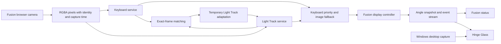
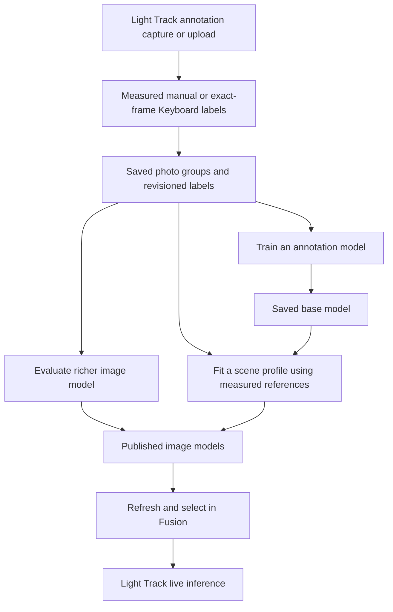

# Workspace architecture

This workspace estimates a laptop hinge angle from the front camera and can use that angle to animate the live Windows desktop. Keyboard measurements take priority; a photo-trained Light Track model supplies provisional estimates when the keyboard is unavailable. Fusion turns those measurements into continuous display motion. Hinge Glass renders that motion independently.

## Components and ownership

| Component | Responsibility | Boundary |
| --- | --- | --- |
| Fusion launcher | Start or reuse compatible services; stop processes it owns | Does not install dependencies or stop independently launched services |
| Fusion browser and coordinator | Own one camera capture, distribute frames, select measurements, smooth motion, publish angles | No model training or persistent frame recording |
| Keyboard service | Detect the moving keyboard boundary and return a valid angle or an unavailable result | Separate process; advertises its model, camera dimensions and supported angle range |
| Light Track | Photo annotation, model training, scene calibration, image inference and temporary live adaptation | Separate process; owns photos, models, profiles and inference workers |
| Hinge Glass | Capture a Windows monitor and project its image using manual, scripted or Fusion angles | Native application; owns no camera or estimator |

One Git repository tracks `keyboard/`, `light-track/`, `fusion/`, `renderer/` and their documentation. The components remain separate applications with their own runtime dependencies and configuration. A clone includes their sources and tests; local environments, datasets and trained artifacts must be provisioned separately. See the [Keyboard architecture](../keyboard/docs/architecture.md) and [Light Track architecture](../light-track/docs/architecture.md) for estimator internals.

## Startup and live measurement

1. The launcher checks local service identities and configuration, starts missing dependencies, and waits for readiness before starting Fusion. An incompatible occupied port or startup failure stops the attempt and cleans up only its own processes.
2. **Start camera** allocates a Fusion session. Camera geometry comes from Keyboard health when available, otherwise Light Track or Fusion defaults. A saved profile must match width, height and horizontal field of view; an incompatible profile is reported and image measurement is disabled for that session.
3. The browser requests that exact resolution and uploads RGBA frames with increasing IDs, monotonic capture timestamps and available camera settings. Cancellation, camera failure or disconnect releases its tracks and coordinator session. Service leases reject competing inference owners, so stop Fusion before using Keyboard-assisted photo collection.
4. The browser upload queue and each service queue keep one running frame and one replaceable pending frame. Slow processing drops intermediate frames instead of accumulating a timeline. Responses must match the active service session, frame and timestamp; lighting generations reject results from a replaced model.
5. A fresh valid Keyboard result supplies the exact target. Brief keyboard loss can retain its last reading within the configured grace; otherwise a fresh valid Light Track result supplies the fallback. Neither source available means no current measurement, even if a previous display value remains visible.
6. Fusion updates the display controller independently of capture and publishes its angle, velocity, source, age and correction status through a JSON snapshot and server-sent events. Hinge Glass consumes the displayed angle rather than the raw measurement.

Session status, measurement selection and display motion are separate state machines. For example, `state: UNAVAILABLE` can coexist briefly with a retained display target; `controllerState: STALE` means display motion is frozen. The exact states and transitions are in [Fusion architecture](../fusion/docs/architecture.md).

Keyboard authority is an application policy, not a guarantee of physical accuracy. Rejected or unavailable Keyboard results cannot supply new targets or adaptation anchors. Keyboard motion alone drives keyboard targets; scene motion cannot override them. Light Track estimates remain provisional, including after temporary adaptation. The current display range is 10–120°.

## Photos, models and adaptation

Photo annotations are the training and calibration input. Automatic collection saves the exact frame that received a valid Keyboard label; manual measurements cover other angles. A scene profile binds a base model, camera geometry and measured references. Standard v1 annotation models can be used in standalone Light Track or as bases for published scene profiles; Fusion's selector lists published image models and profiles.

Published artifacts are immutable. Editing or deleting a source photo requires training a new artifact to incorporate the correction. Light Track serializes photo mutations, checks revisions and holds usage leases during collection, training and fitting. Photo deletion journals file removal and commits by atomically replacing the manifest; restart completes cleanup or rolls back the uncommitted deletion. Offline trainers do not share these leases and require stable inputs.

Live adaptation is separate from training. Fusion matches Keyboard and Light Track results by frame ID and timestamp, then sends an anchor to Light Track's bounded session cache. Light Track validates the cached frame and model generation and adjusts a temporary affine correction. Restarting the session discards that correction; exporting it does not publish a model. The current live anchor endpoint accepts 10–45°, even when Keyboard advertises a 46° endpoint. A rejected anchor does not invalidate Fusion's keyboard target.

## Data and configuration

| Data | Owner and lifetime |
| --- | --- |
| Camera pixels and service queues | Browser and service memory; replaced as frames advance and released on stop |
| Latest measurements, display trajectory and matched pairs | Fusion session memory; feature vectors are discarded and pairs are bounded to 256 by default |
| Temporary correction and cached inference features | Light Track session memory; bounded by its service configuration |
| Photo groups, labels, model artifacts and selected profile | Light Track storage under its configured data/artifact directories; profile selection persists across restarts |
| Keyboard angle model and annotations | Keyboard component's configured local data storage |
| Render preferences | `%LOCALAPPDATA%/HingeGlass/preferences.json`, applied over renderer defaults |
| Diagnostic exports | Explicit downloads or renderer reports under the chosen output path; live desktop pixels are not saved |

[Fusion configuration](../fusion/config.json) controls service addresses, capture rate, queue/lease limits, source freshness and controller timing. [Renderer configuration](../renderer/config.json) controls geometry, frosting, angle freshness and presentation. Keyboard and Light Track manage their own models, runtimes and configurations. Shared defaults and dependency manifests are tracked; Keyboard's machine-specific `config.json`, Python environments, local data and trained artifacts are ignored and are not included in a clone.

## Desktop rendering and failures

Hinge Glass captures the composed monitor on the GPU, adds the cursor, rotates a virtual desktop plane around its fixed active bottom edge, and applies frosting according to each image point's distance from the glass. Preview, calibration grid and live output share the same projection. The reference angle defaults to 110°; at or above it the native desktop is unobscured. Input coordinates stay unchanged.

A capture-excluded, click-through overlay prevents feedback, while separate controls remain accessible. A companion process restores cursor visibility if the renderer exits unexpectedly. A stale or disconnected angle source freezes geometry while desktop capture continues. Capture/device failure hides the effect, restores the cursor and retries resource creation; three consecutive failures leave the app faulted. Lock or sleep suspends rendering. **Ctrl+Alt+F12** disables the effect. See [renderer architecture](../renderer/docs/architecture.md) for lifecycle and transport states.

Service errors affect the failing measurement source rather than blocking the other queue. Expired service sessions reconnect on later frames; malformed, reordered and obsolete responses are rejected. If neither source recovers, Fusion retains its last display value without claiming a fresh measurement. A new start may replace an idle Fusion session after its lease threshold; this is not a background camera-stop timer.

## Evidence and constraints

The architecture was checked against the current coordinator, service clients, controller, launcher, renderer and the estimator service interfaces. Automated tests cover successful flows, source loss, stale identities, queue bounds, correction deadlines and independent projection controls. They do not establish physical camera accuracy, unseen-scene transfer, HDR behavior, game contention or physical lid/panel behavior. Renderer tests use a 60 Hz cap and do not change Windows refresh settings.

Research sources actually used and their limits are recorded in [technical design](technical-design.md), [renderer research](../renderer/docs/research.md), [Light Track research](../light-track/docs/scene-model-research.md) and [Keyboard identity research](../keyboard/docs/identity-research.md). Dated changes and historical validation belong in [iteration history](iteration.md).
