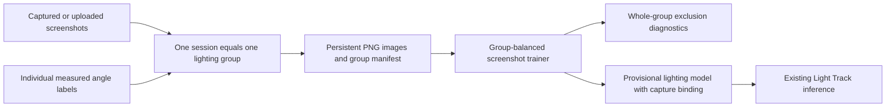
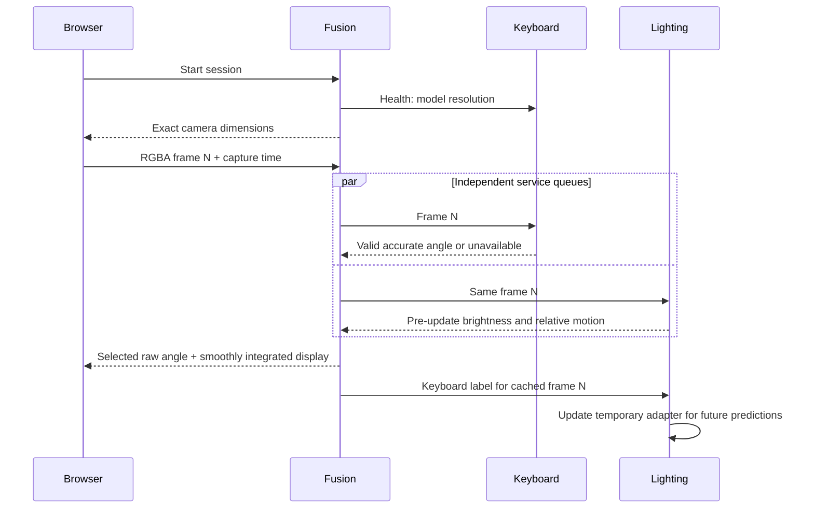
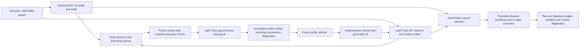
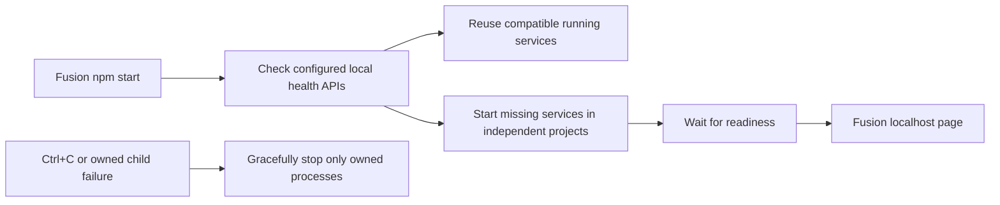
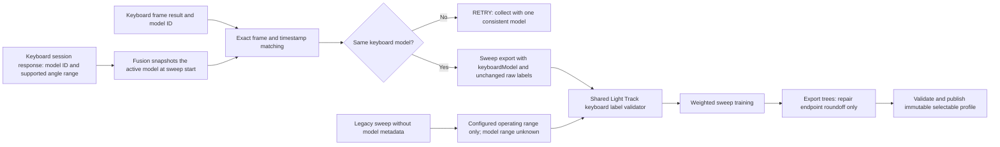

# Workspace architecture

The three independently runnable components communicate over loopback HTTP. The root Git repository manages the fusion coordinator and integration documentation; the existing repositories manage their own APIs and estimators. All use `main`.

Light Track's standalone annotation workspace saves still-image labels independently of the Fusion video research paths. Its own camera configuration uses 640×480/60° uncalibrated defaults; no Keyboard configuration is read. Lighting artifacts carry their own capture requirements.

Groups have no fixed angle schedule or screenshot count. Repeating a lighting setup still creates a new group. The final model fits all labeled ended groups; diagnostic partitions keep groups together and never imply unseen-lighting independence merely from a new session ID. Screenshots do not replace the synchronized motion references needed by Fusion's motion and latency evaluation.

```mermaid
flowchart LR
    Camera[Browser front camera] --> Frames[RGBA8 bytes and capture timestamp]
    Frames --> Upload[Coordinator upload endpoint]
    Upload --> KQ[Keyboard: one active and latest waiting frame]
    Upload --> LQ[Lighting: one active and latest waiting frame]
    KQ --> K[Keyboard HTTP service]
    LQ --> L[Light Track HTTP service]
    K --> Select[Keyboard-priority selection]
    L --> Select
    K --> Pair[Pair by frame ID and timestamp]
    L --> Pair
    Pair --> Labels[Accurate keyboard labels]
    Labels --> L
    Select --> Control[Persistent motion-based display controller]
    Control --> SSE[SSE and current-angle API]
    SSE --> UI[Angle, source, freshness, adaptation]
    L --> Record[Lighting records and causal adapter snapshot]
    Control --> Timeline[Actual display timeline]
    Record --> Export[Explicit local recording download]
    Timeline --> Export
```

There is one physical capture owner. The services never open a camera. Independent queue backpressure drops pending frames rather than building latency. Session IDs prevent previous owners' results from reviving a stopped session. Capture timestamps remain in browser monotonic milliseconds across APIs; the keyboard wrapper converts to seconds at its estimator call only.

The coordinator keeps one display controller through visibility changes and adapter versions. It estimates velocity from a 250 ms keyboard window or calibrated relative scene rotation. The controller uses filtered physical velocity feedforward plus seventh-degree correction trajectories that retain the original one-second deadline and preserve position, velocity, acceleration, and jerk across replanning. It does not differentiate selected angle jumps.

See [fusion architecture](../fusion/docs/architecture.md) and [technical design](technical-design.md).

## Sweep calibration and smooth deadline controller — 2026-09-14

```mermaid
stateDiagram-v2
  [*] --> WAIT_SMALL_ANGLE
  WAIT_SMALL_ANGLE --> OPENING: stable keyboard below 25 degrees
  OPENING --> UPPER_HOLD: reliable stop or explicit user hold; pace accepted
  UPPER_HOLD --> CLOSING: visual departure or manual start
  CLOSING --> LOWER_HOLD: keyboard below 25 degrees
  LOWER_HOLD --> TRAINING: stable hold and pace accepted
  TRAINING --> READY: immutable profile published and activated
  OPENING --> RETRY: pace, gap, direction or configuration failure
  CLOSING --> RETRY: pace, gap, direction or configuration failure
  TRAINING --> RETRY: job failure
  RETRY --> WAIT_SMALL_ANGLE: new attempt
```

Fusion owns workflow timing; Light Track owns features, recording, model training, profile persistence, and inference. Keyboard code remains in its own repository. The 120-degree upper endpoint is user-supplied; reliable visual motion detects stopping only. Manual upper/departure controls cover unavailable motion tracking. Holds last 0.8 seconds, keyboard pace requires eight samples and ten degrees of coverage, and accepted speed mismatch is at most 20%. Model coverage reflects actual small endpoints. Raw keyboard labels remain authoritative; hidden labels are explicitly inferred from timestamps, with a 300 ms boundary exclusion. Inferred labels cannot enter independent accuracy evaluation.

```mermaid
stateDiagram-v2
  [*] --> STALE
  STALE --> TRACKING: fresh target within tolerance
  STALE --> CHASING: fresh discrepancy above one degree
  TRACKING --> CHASING: discrepancy above one degree
  CHASING --> CHASING: retarget from current position, speed, acceleration and jerk
  CHASING --> TRACKING: correction completed
  TRACKING --> STALE: stale input
  CHASING --> STALE: target older than 500 ms; freeze and retain deadline
```

The physical path uses three exact first-order velocity stages with a combined mean delay of 120 ms. This keeps physical velocity, acceleration, and jerk continuous when the supplied motion changes. Septic correction paths match all four derivatives at replanning boundaries. Analytical roots of polynomial derivatives determine preferred speed, acceleration, and jerk violations. The shortest candidate satisfying preferences is chosen; otherwise the candidate minimizing normalized violation is used before the immutable one-second deadline. A 250 ms tracking horizon and 0.95 s initial correction maximum leave scheduling reserve. Preferred limits are configurable and can be exceeded to meet the deadline. Position is clamped only at the physical operating range; stale gaps freeze retained output. These two cases are explicit continuity exceptions.

Light Track stores profiles under `data/profiles/:id`, publishing only after training artifacts validate. A separate atomically replaced selection file remembers the chosen ID; models/recordings are immutable. Temporary adapter anchors never overwrite them. Session creation supports `mode: features-only` to collect even with an incompatible CLI model, and `initialization: model-output` avoids a spurious 120-degree startup correction. Activation is queued for the next frame; generation IDs reject obsolete model results and anchors. Motion workers reset when model calibration changes and do not return old calibration velocities during the reset.

## Unified startup and retained correction deadlines

`start.js` and the generic launcher handle runtime discovery, local port validation, bounded readiness checks, IPC shutdown of Node services, and the keyboard subprocess. Model/profile state stays in Light Track. `npm run start:coordinator` retains independent startup.

```mermaid
stateDiagram-v2
  CHASING --> CHASING: fresh reading or brief display-target hold; deadline unchanged
  CHASING --> STALE: target age exceeds 500 ms; retain deadline and freeze position
  STALE --> CHASING: fresh target resumes before original deadline
  STALE --> OVERDUE: original deadline expires
  CHASING --> OVERDUE: deadline expires before convergence
  OVERDUE --> OVERDUE: recover continuously; countdown stays at zero
  CHASING --> TRACKING: fresh target reached within tolerance
  OVERDUE --> TRACKING: target reached; report missed deadline
```

`OVERDUE` is exposed as a flag on the persistent chase rather than a new source-selection state. A correction starts with a 1000 ms deadline; its first trajectory is at most 950 ms. Repeated missing results do not restart its trajectory or countdown. The display may follow a separately aged target for at most 500 ms, while the selected raw measurement remains unavailable. Longer gaps freeze movement but retain the original deadline. This fixes stationary stagnation caused by discarding the curve repeatedly. The actual monotonic clock remains authoritative; overdue work is never represented as a new full countdown.

## Automatic keyboard limits for calibration — 2026-09-15

Fusion obtains `modelId` and `angleRange` from the active keyboard session API; it does not read the keyboard project's configuration or model files. The range is already the keyboard model's supported range intersected with its configured operating limits (currently 10–46 degrees). The sweep captures this contract once, checks the model ID on subsequent matched frames, and supplies it automatically to training. A model change requires a new sweep. Future model ranges need no Light Track code edits.

The sweep trainer and shared source-recording loader use one validator. Recorded model limits are intersected with the lighting operating range from configuration; malformed contracts or out-of-range labels fail with the frame, angle, and accepted limits. Labels remain exact. The recording, model, report, and profile preserve `keyboardLabelValidation` with the model ID, reported range, accepted range, and range source.

Older exports never recorded keyboard model metadata. They retain matching-frame provenance and use the configured lighting operating range, explicitly marked `legacy-operating-range-only`; the current model is not retroactively claimed as the original model. This compatibility path does not certify the missing historical model range. Independent accuracy gates remain unchanged.

The shared tree exporter corrects only floating-point endpoint roundoff (for example, 120.00000000000006 to 120). It rejects materially out-of-range predictions and does not alter source labels or fitted trees. Runtime model validation remains strict.
