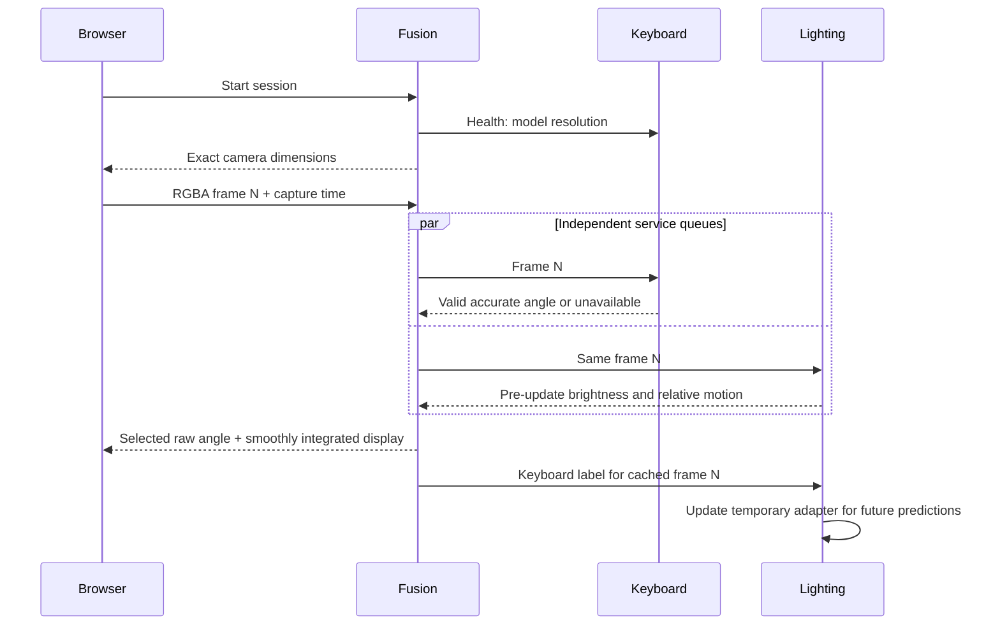

# Workspace architecture

The three independently runnable components communicate over loopback HTTP. The root Git repository manages the fusion coordinator and integration documentation; the existing repositories manage their own APIs and estimators. All use `main`.

```mermaid
flowchart LR
    Camera[Browser front camera] --> Frames[RGBA8 bytes and capture timestamp]
    Frames --> Upload[Coordinator upload endpoint]
    Upload --> KQ[Keyboard: one active and latest waiting frame]
    Upload --> LQ[Lighting: one active and latest waiting frame]
    KQ --> K[Keyboard HTTP service]
    LQ --> L[Light Track HTTP service]
    K --> Select[Keyboard-priority selection]
    L --> Select
    K --> Pair[Pair by frame ID and timestamp]
    L --> Pair
    Pair --> Labels[Accurate keyboard labels]
    Labels --> L
    Select --> Control[Persistent motion-based display controller]
    Control --> SSE[SSE and current-angle API]
    SSE --> UI[Angle, source, freshness, adaptation]
    L --> Record[Lighting records and causal adapter snapshot]
    Control --> Timeline[Actual display timeline]
    Record --> Export[Explicit local recording download]
    Timeline --> Export
```

There is one physical capture owner. The services never open a camera. Independent queue backpressure drops pending frames rather than building latency. Session IDs prevent previous owners' results from reviving a stopped session. Capture timestamps remain in browser monotonic milliseconds across APIs; the keyboard wrapper converts to seconds at its estimator call only.

The coordinator keeps one display controller through visibility changes and adapter versions. It estimates velocity from a 250 ms keyboard window or calibrated relative scene rotation. The controller uses filtered velocity feedforward plus filtered, saturated error feedback, with a bound tied to the inferred motion. It does not differentiate selected angle jumps.

See [fusion architecture](../fusion/docs/architecture.md) and [technical design](technical-design.md).
