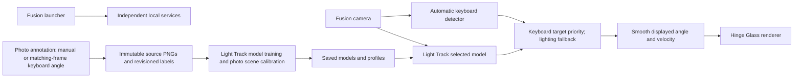
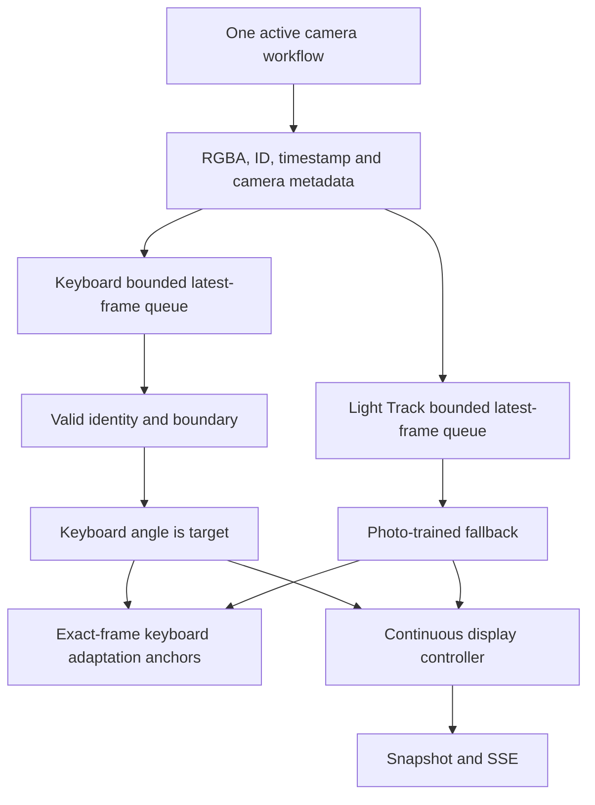
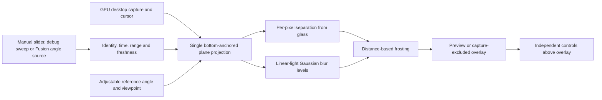
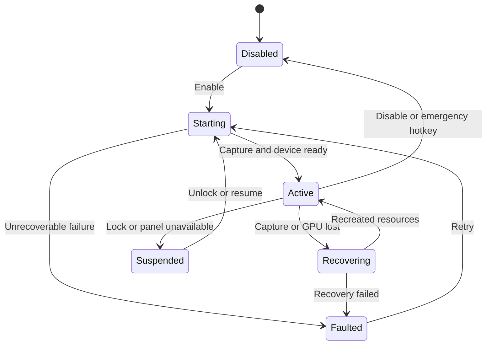

# Workspace architecture

The root repository owns Fusion and Hinge Glass. `keyboard/` and `light-track/` are independent repositories on `main`. Light Track uses photo annotations as its only training and calibration workflow. Keyboard-assisted collection labels exact saved frames within the service-reported range; manual measurements cover other angles. Scene calibration also uses photo references. Sweep calibration, timed checkpoint collection, CSV labeling, geometric absolute-angle setup and reflection simulation are removed. Existing source data and published artifacts remain preserved.

## Measurement and ownership

Fusion discards image feature vectors from coordinator state and keeps a bounded pair cache. It has no training or recording buffers. Rejected keyboard identity results supply no angle or adaptation anchor. Optional identity verifiers remain experimental because none qualified for default promotion; the human identity-review sidecar is separate from measured-angle annotations. Session/generation checks reject stale responses. Camera ownership prevents simultaneous Fusion and annotation capture.

Photo mutation uses serialized revision checks and usage leases. Permanent deletion journals removal and atomically replaces the manifest before cleaning up the PNG. Published models and profiles remain immutable; correcting training data requires a new artifact. Offline trainers require stable inputs outside server lease management.

## Hinge Glass

The renderer has one projection path for grid and live capture. Physical-lid mode is absent. The bottom remains anchored; the top becomes more frosted as image separation from the glass increases. Renderer debug sweeps are animation tests and are unrelated to the removed Light Track training sweeps. Fusion snapshot/SSE reads available bytes immediately, validates session identity, and reconnects automatically. Stale input freezes geometry while live capture continues.

GPU selection and timing identify the actual adapter. Tests use a 60 Hz render cap and never change Windows refresh settings. RTX/240 Hz, full-resolution game contention and physical lid closure remain hardware acceptance items. See [renderer architecture](../renderer/docs/architecture.md), [Fusion architecture](../fusion/docs/architecture.md), and the independent Light Track and Keyboard architecture documents for current details and actual research references.
