# Workspace architecture

## Light Track 0.14.0 — Scene robustness — 2026-09-17

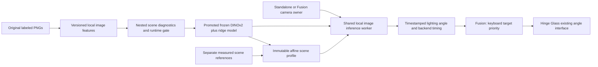

Light Track's original v1 features/models and annotation files remain unchanged. New models use a versioned image predictor and shared offline/live extraction; they enter the selectors only after grouped accuracy, export parity and backend runtime checks. The 253-image development set favors frozen DINOv2 features over extra photometric values or relative depth. An optional scene guide reuses screenshot storage with actual keyboard/manual labels, then publishes a separately selected affine profile. Detailed data flow, state transitions and limitations are in `light-track/docs/architecture.md` and `light-track/docs/scene-model-research.md` in the independent Light Track repository. Fusion and renderer angle protocols are unchanged, and graphics testing remains capped at 60 fps.

## Fusion 0.2.2 — Keyboard target priority — 2026-09-17

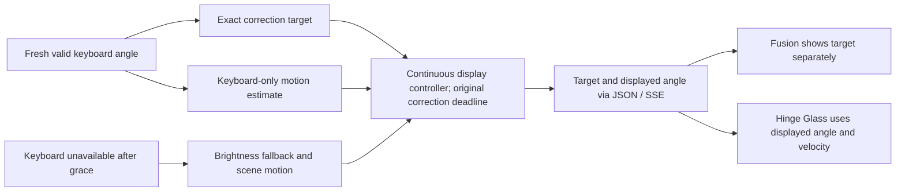

Fusion previously selected the keyboard measurement but allowed unrelated scene motion to shift its display target and future trajectory. Sparse keyboard observations could therefore remain far from the displayed angle even while marked authoritative. Keyboard targets now exclude scene-motion input and sample-age extrapolation, including short retained-target intervals. Available keyboard velocity still drives smooth tracking; brightness remains the fallback after keyboard loss. The existing source and controller state machines, configured freshness limits and immutable correction deadline remain in use. See [Fusion architecture](../fusion/docs/architecture.md#keyboard-correction-targets--fusion-022-2026-09-17) and [validation](../fusion/docs/keyboard-target-validation.md).

## Hinge Glass 0.1.5 — Fusion connection — 2026-09-17

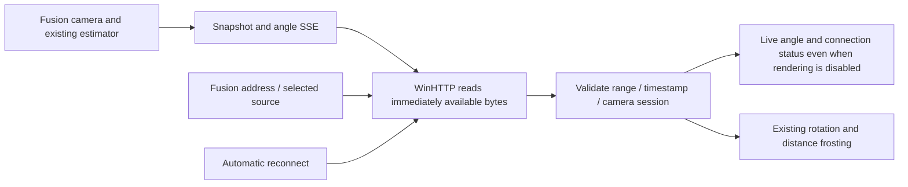

The renderer previously requested fixed 8 KiB reads from a continuous event stream. WinHTTP buffered small publications while its control panel continued to say it was connecting. Reading available bytes delivers events immediately. `/api/angle` and `/api/events` now use the same acceptance/status path, and reconnects retain obsolete-session protection. Network state is distinct from angle freshness and the renderer lifecycle. Camera ownership, publication format and Fusion estimation are unchanged. `start.ps1 -Fusion` selects the source at launch; the manual slider remains an explicit switch to debug input. See the [connection state diagram](../renderer/docs/architecture.md#fusion-connection-and-angle-freshness).

## Hinge Glass 0.1.4 — 2026-09-17

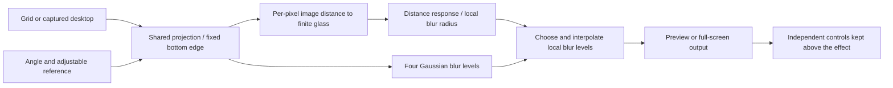

Frosting now depends on separation from the glass: the hinge remains clear and the top loses more detail as it recedes. `frostDistanceMm` calibrates the buildup and is editable during rendering. GPU-only linear-light processing uses per-pixel radius, four reduced-resolution Gaussian levels and variance interpolation. Independent double-precision closest-point controls and actual HLSL tests cover distance, projection, closure, clear boundaries and spatial detail loss. The debug controls stay above the unowned full-screen overlay, with a native pointer over the panel. Physical-lid mode and its UI/config/CLI/script selectors have been removed at the user's request. Grid, live, preview, full-screen and benchmarks now have only the bottom-anchored rotation path; legacy settings cannot restore another projection. Renderer states and Fusion angle estimation remain unchanged. See [renderer architecture](../renderer/docs/architecture.md) for geometry, data flow and lifecycle diagrams. The versioned sections below describe historical designs.

## Hinge Glass 0.1.2 — 2026-09-17

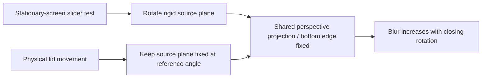

The default slider-test mode uses a rigid rotating plane so the full texture stays visible while testing on a stationary screen. The explicit **Physical lid** view mode retains the original world-anchored image behavior: the physical display moves while the reference plane remains fixed. Preview, grid and full-screen output use the same selected projection; changing output never changes modes automatically. This prevents mistaking compensation viewed on a stationary monitor for the intended physical effect. Frosting is stronger and uses a dense Gaussian kernel. All tests remain capped at 60 fps. Preview sizing preserves the monitor aspect ratio.

## Hinge Glass 0.1.1 — 2026-09-17

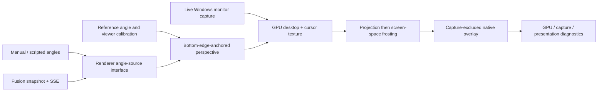

Hinge Glass is an independently runnable C++/WinRT/D3D11 application managed by this root Git repository. The full active bottom edge is the stationary visual pivot. A nonzero mechanical-hinge offset changes viewer calibration without moving that visual pivot. Reference angle defaults to 110° and is user-adjustable. The default test cap is 60 Hz; 240 Hz is supported when explicitly configured. Input coordinates remain native while the cursor is rendered on the virtual plane.

Fusion's existing APIs and camera ownership are unchanged. Its smoothed display angle is optional input, and its present 10–120° range is never remapped to imply full closure. Native capture, rendering, UI, and source reception run independently. See [renderer architecture](../renderer/docs/architecture.md) for the geometry derivation, resource state machine, and cursor recovery workflow.

## Compatible annotation model improvement — 2026-09-16

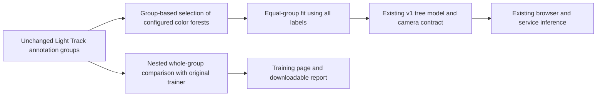

Light Track 0.13.0 reuses existing color-ratio features, selects regularization on complete groups, and maps forest split indices into the original feature schema. No migration of groups, PNGs, labels, keyboard provenance, or historical models is needed. Small or inconclusive datasets retain the original trainer. Independent validation flags remain false, and the report separates tuning from nested development-data diagnostics. Keyboard and Fusion interfaces remain compatible. Detailed research sources and measured limitations live in Light Track's `docs/annotation-model-research.md`.

## Light Track model selection — 2026-09-16

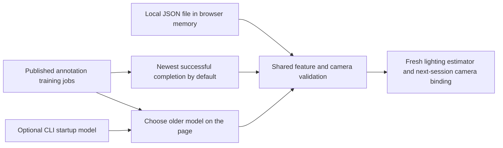

Selection belongs to the standalone browser page and reuses existing annotation/model endpoints. It does not alter Fusion profiles or replace source artifacts. The page locks selection during capture, validates candidates before installing them, preserves the current model on failure, and chooses the latest annotation again on reload. Manual choices are retained by Refresh models. Local JSON files are not uploaded.

The three independently runnable components communicate over loopback HTTP. The root Git repository manages the fusion coordinator and integration documentation; the existing repositories manage their own APIs and estimators. All use `main`.

Light Track's standalone annotation workspace saves still-image labels independently of the Fusion video research paths. Optional automatic collection owns a Keyboard API session and labels the exact same pixels using its model-reported angle range. Its own camera configuration uses 640×480/60° uncalibrated defaults; no Keyboard configuration is read. Lighting artifacts carry their own capture requirements.

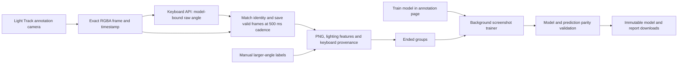

Automatic collection pauses on invalid visibility, retains repeated angles, and requires a restart after service, model, camera or revision failures. Stop settles any active save and releases only its own Keyboard session; idle leases recover abandoned browser sessions. The existing Fusion launcher starts all services, but Fusion's camera must be stopped while annotation owns Keyboard. Page training retains the group boundaries and provisional status of CLI training. See the Light Track architecture for API and state-machine details.

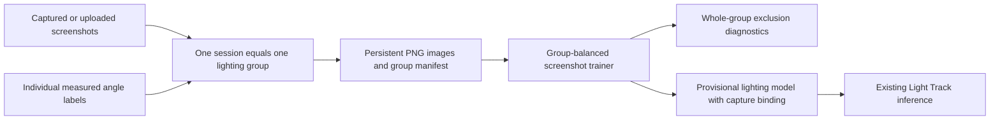

Groups have no fixed angle schedule or screenshot count. Repeating a lighting setup still creates a new group. The final model fits all labeled ended groups; diagnostic partitions keep groups together and never imply unseen-lighting independence merely from a new session ID. Screenshots do not replace the synchronized motion references needed by Fusion's motion and latency evaluation.

```mermaid
flowchart LR
    Camera[Browser front camera] --> Frames[RGBA8 bytes and capture timestamp]
    Frames --> Upload[Coordinator upload endpoint]
    Upload --> KQ[Keyboard: one active and latest waiting frame]
    Upload --> LQ[Lighting: one active and latest waiting frame]
    KQ --> K[Keyboard HTTP service]
    LQ --> L[Light Track HTTP service]
    K --> Select[Keyboard-priority selection]
    L --> Select
    K --> Pair[Pair by frame ID and timestamp]
    L --> Pair
    Pair --> Labels[Accurate keyboard labels]
    Labels --> L
    Select --> Control[Persistent motion-based display controller]
    Control --> SSE[SSE and current-angle API]
    SSE --> UI[Angle, source, freshness, adaptation]
    L --> Record[Lighting records and causal adapter snapshot]
    Control --> Timeline[Actual display timeline]
    Record --> Export[Explicit local recording download]
    Timeline --> Export
```

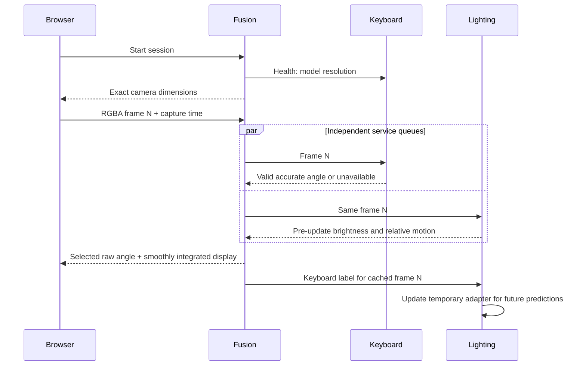

There is one physical capture owner. The services never open a camera. Independent queue backpressure drops pending frames rather than building latency. Session IDs prevent previous owners' results from reviving a stopped session. Capture timestamps remain in browser monotonic milliseconds across APIs; the keyboard wrapper converts to seconds at its estimator call only.

The coordinator keeps one display controller through visibility changes and adapter versions. It estimates velocity from a 250 ms keyboard window or calibrated relative scene rotation. The controller uses filtered physical velocity feedforward plus seventh-degree correction trajectories that retain the original one-second deadline and preserve position, velocity, acceleration, and jerk across replanning. It does not differentiate selected angle jumps.

See [fusion architecture](../fusion/docs/architecture.md) and [technical design](technical-design.md).

## Sweep calibration and smooth deadline controller — 2026-09-14

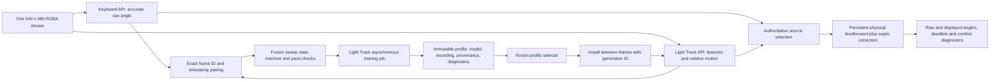

```mermaid
stateDiagram-v2
  [*] --> WAIT_SMALL_ANGLE
  WAIT_SMALL_ANGLE --> OPENING: stable keyboard below 25 degrees
  OPENING --> UPPER_HOLD: reliable stop or explicit user hold; pace accepted
  UPPER_HOLD --> CLOSING: visual departure or manual start
  CLOSING --> LOWER_HOLD: keyboard below 25 degrees
  LOWER_HOLD --> TRAINING: stable hold and pace accepted
  TRAINING --> READY: immutable profile published and activated
  OPENING --> RETRY: pace, gap, direction or configuration failure
  CLOSING --> RETRY: pace, gap, direction or configuration failure
  TRAINING --> RETRY: job failure
  RETRY --> WAIT_SMALL_ANGLE: new attempt
```

Fusion owns workflow timing; Light Track owns features, recording, model training, profile persistence, and inference. Keyboard code remains in its own repository. The 120-degree upper endpoint is user-supplied; reliable visual motion detects stopping only. Manual upper/departure controls cover unavailable motion tracking. Holds last 0.8 seconds, keyboard pace requires eight samples and ten degrees of coverage, and accepted speed mismatch is at most 20%. Model coverage reflects actual small endpoints. Raw keyboard labels remain authoritative; hidden labels are explicitly inferred from timestamps, with a 300 ms boundary exclusion. Inferred labels cannot enter independent accuracy evaluation.

```mermaid
stateDiagram-v2
  [*] --> STALE
  STALE --> TRACKING: fresh target within tolerance
  STALE --> CHASING: fresh discrepancy above one degree
  TRACKING --> CHASING: discrepancy above one degree
  CHASING --> CHASING: retarget from current position, speed, acceleration and jerk
  CHASING --> TRACKING: correction completed
  TRACKING --> STALE: stale input
  CHASING --> STALE: target older than 500 ms; freeze and retain deadline
```

The physical path uses three exact first-order velocity stages with a combined mean delay of 120 ms. This keeps physical velocity, acceleration, and jerk continuous when the supplied motion changes. Septic correction paths match all four derivatives at replanning boundaries. Analytical roots of polynomial derivatives determine preferred speed, acceleration, and jerk violations. The shortest candidate satisfying preferences is chosen; otherwise the candidate minimizing normalized violation is used before the immutable one-second deadline. A 250 ms tracking horizon and 0.95 s initial correction maximum leave scheduling reserve. Preferred limits are configurable and can be exceeded to meet the deadline. Position is clamped only at the physical operating range; stale gaps freeze retained output. These two cases are explicit continuity exceptions.

Light Track stores profiles under `data/profiles/:id`, publishing only after training artifacts validate. A separate atomically replaced selection file remembers the chosen ID; models/recordings are immutable. Temporary adapter anchors never overwrite them. Session creation supports `mode: features-only` to collect even with an incompatible CLI model, and `initialization: model-output` avoids a spurious 120-degree startup correction. Activation is queued for the next frame; generation IDs reject obsolete model results and anchors. Motion workers reset when model calibration changes and do not return old calibration velocities during the reset.

## Unified startup and retained correction deadlines

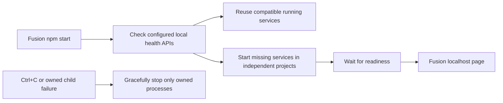

`start.js` and the generic launcher handle runtime discovery, local port validation, bounded readiness checks, IPC shutdown of Node services, and the keyboard subprocess. Model/profile state stays in Light Track. `npm run start:coordinator` retains independent startup.

```mermaid
stateDiagram-v2
  CHASING --> CHASING: fresh reading or brief display-target hold; deadline unchanged
  CHASING --> STALE: target age exceeds 500 ms; retain deadline and freeze position
  STALE --> CHASING: fresh target resumes before original deadline
  STALE --> OVERDUE: original deadline expires
  CHASING --> OVERDUE: deadline expires before convergence
  OVERDUE --> OVERDUE: recover continuously; countdown stays at zero
  CHASING --> TRACKING: fresh target reached within tolerance
  OVERDUE --> TRACKING: target reached; report missed deadline
```

`OVERDUE` is exposed as a flag on the persistent chase rather than a new source-selection state. A correction starts with a 1000 ms deadline; its first trajectory is at most 950 ms. Repeated missing results do not restart its trajectory or countdown. The display may follow a separately aged target for at most 500 ms, while the selected raw measurement remains unavailable. Longer gaps freeze movement but retain the original deadline. This fixes stationary stagnation caused by discarding the curve repeatedly. The actual monotonic clock remains authoritative; overdue work is never represented as a new full countdown.

## Automatic keyboard limits for calibration — 2026-09-15

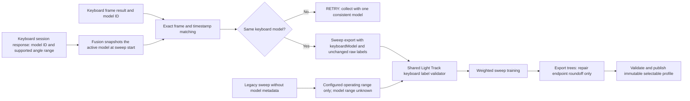

Fusion obtains `modelId` and `angleRange` from the active keyboard session API; it does not read the keyboard project's configuration or model files. The range is already the keyboard model's supported range intersected with its configured operating limits (currently 10–46 degrees). The sweep captures this contract once, checks the model ID on subsequent matched frames, and supplies it automatically to training. A model change requires a new sweep. Future model ranges need no Light Track code edits.

The sweep trainer and shared source-recording loader use one validator. Recorded model limits are intersected with the lighting operating range from configuration; malformed contracts or out-of-range labels fail with the frame, angle, and accepted limits. Labels remain exact. The recording, model, report, and profile preserve `keyboardLabelValidation` with the model ID, reported range, accepted range, and range source.

Older exports never recorded keyboard model metadata. They retain matching-frame provenance and use the configured lighting operating range, explicitly marked `legacy-operating-range-only`; the current model is not retroactively claimed as the original model. This compatibility path does not certify the missing historical model range. Independent accuracy gates remain unchanged.

The shared tree exporter corrects only floating-point endpoint roundoff (for example, 120.00000000000006 to 120). It rejects materially out-of-range predictions and does not alter source labels or fitted trees. Runtime model validation remains strict.
