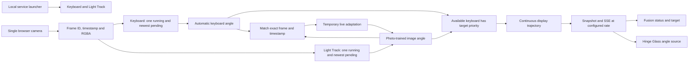
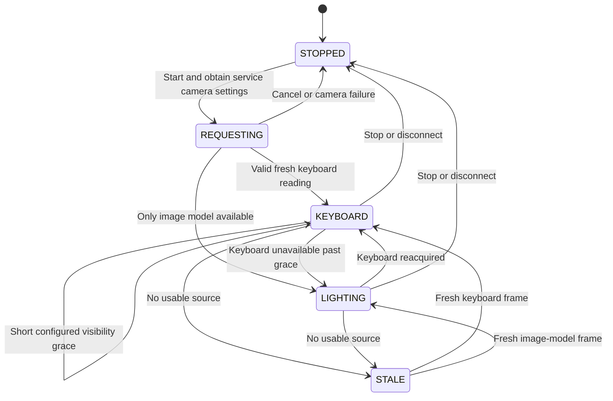
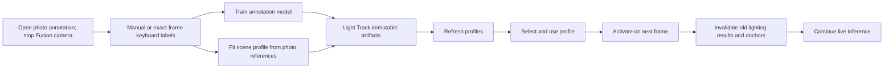

# Fusion architecture

Keyboard and Light Track are independent repositories and HTTP services. Fusion owns camera fan-out, source selection and smooth display output. Light Track owns photo annotation, training, scene fitting and immutable profile storage. The coordinator keeps compact service summaries and a bounded frame-pair cache. Feature vectors are discarded after receipt; no training or recording timeline is retained. Session identity, monotonic frame IDs, capture timestamps and model generations reject obsolete work.

The keyboard target is exact, without lighting motion or sample-age extrapolation. Available keyboard velocity drives smooth motion. Light Track motion is used only during lighting fallback. Existing brief target holds do not imply a new measurement. The display controller preserves position, velocity, acceleration and jerk when replanning; a correction's original deadline is retained through temporary gaps. The renderer consumes the displayed angle and velocity, with freshness separate from rendering state.

Profile camera geometry is checked before activation. Existing published profiles can still be loaded/exported. Sweep, recording, checkpoint and CSV-reference actions return 410 and have no runtime handler. All new training and calibration uses photo annotations; suggested angles never become labels without a measurement. Keyboard rejection/unavailable status cannot supply targets, photo labels or adaptation anchors. Relative-motion helpers remain inference-only.

`config.json` owns camera rate, network/lease limits, source freshness, controller settings and output cadence. The launcher uses bounded readiness checks and closes only owned services. Keyboard recognition and Light Track research references are maintained in their own repositories. Hardware evaluation uses 60 Hz renderer tests without changing system refresh settings.
