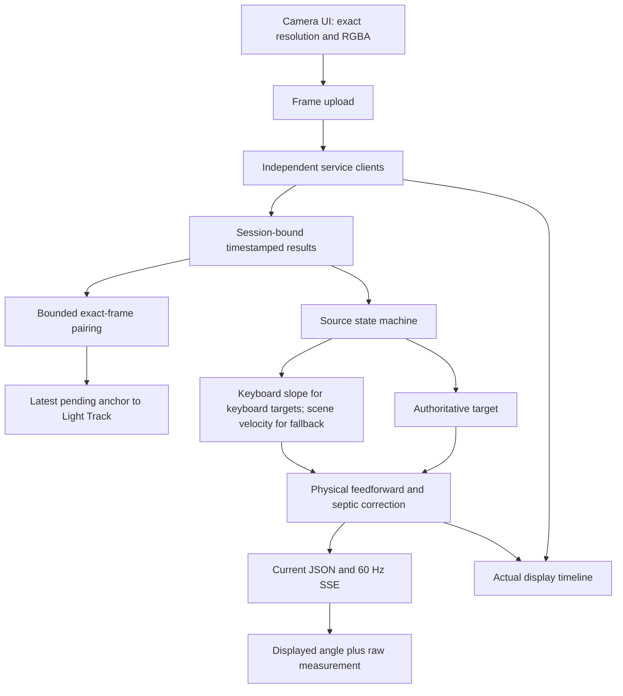
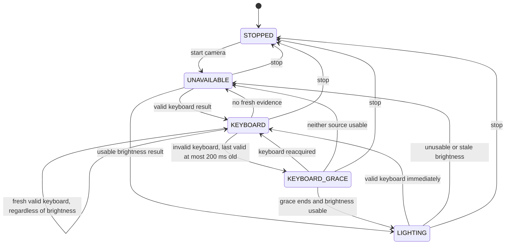
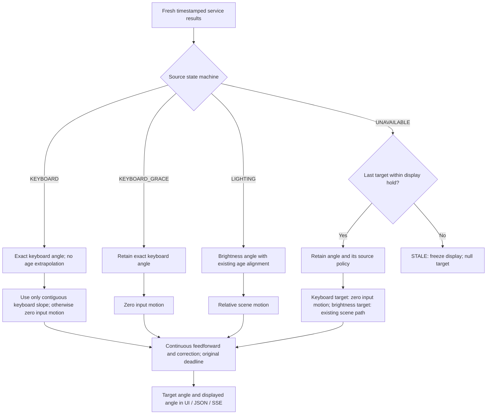
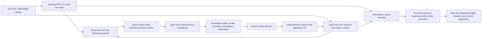
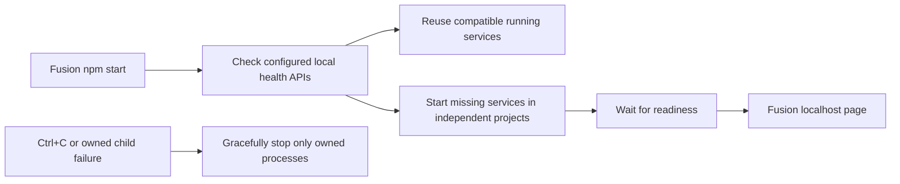
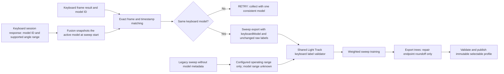

# Fusion architecture and workflows

`FusionEngine.ingest()` accepts increasing capture timestamps independently for each source. Keyboard validity comes from the service; the fusion layer never compares its value against brightness to accept/reject it. A valid sample is authoritative until superseded or stale. An explicit loss gets a 200 ms grace period from the last valid capture. Samples older than 500 ms never become a current measurement.

`DisplayController.update(target, motion, timestamp, observation)` retains position through jerk, exact filtered physical motion, and a deadline-bound septic correction. It advances physical motion in bounded substeps and evaluates correction polynomials directly. Stale gaps freeze position, retain the chase deadline, and clear derivative states; resuming starts from the retained position. Control constants reside in `config.json`.

## Keyboard correction targets — Fusion 0.2.2, 2026-09-17

`FusionEngine` binds input motion to the selected target source. Keyboard motion needs the configured minimum samples and span within its velocity window. If these are missing, a valid keyboard reading still drives correction; scene velocity cannot replace its missing slope. Grace and display-only holds retain that restriction until a brightness target is actually selected. Existing filtered velocity decays through the physical-motion stages, preserving continuity on source changes.

The observation flag `extrapolateTarget: false` keeps an exact keyboard correction target across its sample age and is stored with the last measurement for display holds. It prevents residual velocity from the previous source from shifting the keyboard target. A future trajectory waypoint can still follow measured keyboard velocity; its feedback reference remains the actual keyboard angle. Brightness retains its existing age alignment. `targetAngleDeg` publishes this feedback reference and becomes null on stale freeze. The renderer continues consuming `displayAngleDeg` and `displayVelocityDegS`.

The existing 200 ms keyboard grace, 500 ms measurement freshness/display hold, 250 ms velocity window and 1-second correction deadline remain configured in `config.json`. There is no new smoothing filter. The [validation note](keyboard-target-validation.md) records independent counterexamples and references.

The capture clock is aligned once to coordinator monotonic time on the first uploaded frame; frame IDs and timestamps strictly increase. The UI publishes at the configured camera rate, keeps one upload active plus one latest waiting upload, and does not use its preview canvas as an input. Each service client independently holds one request and one latest pending frame. Failed/expired leases can reconnect, while timeouts retain the active service's lease and do not overtake its worker operation.

The `/api/events` stream contains session-bound angle and source events. Slow SSE readers are closed to prevent an unbounded network buffer and can reconnect. `/api/angle` supplies the same latest output for local applications. Recording and adaptation exports are explicit and bounded; stopping the session clears server-side state.

```mermaid
flowchart LR
    Source[Separate full-range recordings] --> Split[Training / validation / test recording IDs]
    Split --> Train[Light Track training function]
    Train --> Model[Frozen source forest and motion calibration]
    Model --> New[Selected profile and keyboard initialization]
    New --> Online[Matched keyboard anchors after current prediction]
    Online --> Temporary[Bounded temporary adapter]
    Temporary --> Export[Export features and real display timeline]
    Export --> Replay[Causal replay and independent reference scoring]
```

## Sweep calibration and smooth deadline controller — 2026-09-14

```mermaid
stateDiagram-v2
  [*] --> WAIT_SMALL_ANGLE
  WAIT_SMALL_ANGLE --> OPENING: stable keyboard below 25 degrees
  OPENING --> UPPER_HOLD: reliable stop or explicit user hold; pace accepted
  UPPER_HOLD --> CLOSING: visual departure or manual start
  CLOSING --> LOWER_HOLD: keyboard below 25 degrees
  LOWER_HOLD --> TRAINING: stable hold and pace accepted
  TRAINING --> READY: immutable profile published and activated
  OPENING --> RETRY: pace, gap, direction or configuration failure
  CLOSING --> RETRY: pace, gap, direction or configuration failure
  TRAINING --> RETRY: job failure
  RETRY --> WAIT_SMALL_ANGLE: new attempt
```

Fusion owns workflow timing; Light Track owns features, recording, model training, profile persistence, and inference. Keyboard code remains in its own repository. The 120-degree upper endpoint is user-supplied; reliable visual motion detects stopping only. Manual upper/departure controls cover unavailable motion tracking. Holds last 0.8 seconds, keyboard pace requires eight samples and ten degrees of coverage, and accepted speed mismatch is at most 20%. Model coverage reflects actual small endpoints. Raw keyboard labels remain authoritative; hidden labels are explicitly inferred from timestamps, with a 300 ms boundary exclusion. Inferred labels cannot enter independent accuracy evaluation.

```mermaid
stateDiagram-v2
  [*] --> STALE
  STALE --> TRACKING: fresh target within tolerance
  STALE --> CHASING: fresh discrepancy above one degree
  TRACKING --> CHASING: discrepancy above one degree
  CHASING --> CHASING: retarget from current position, speed, acceleration and jerk
  CHASING --> TRACKING: correction completed
  TRACKING --> STALE: stale input
  CHASING --> STALE: target older than 500 ms; freeze and retain deadline
```

The physical path uses three exact first-order velocity stages with a combined mean delay of 120 ms. This keeps physical velocity, acceleration, and jerk continuous when the supplied motion changes. Septic correction paths match all four derivatives at replanning boundaries. Analytical roots of polynomial derivatives determine preferred speed, acceleration, and jerk violations. The shortest candidate satisfying preferences is chosen; otherwise the candidate minimizing normalized violation is used before the immutable one-second deadline. A 250 ms tracking horizon and 0.95 s initial correction maximum leave scheduling reserve. Preferred limits are configurable and can be exceeded to meet the deadline. Position is clamped only at the physical operating range; stale gaps freeze retained output. These two cases are explicit continuity exceptions.

Light Track stores profiles under `data/profiles/:id`, publishing only after training artifacts validate. A separate atomically replaced selection file remembers the chosen ID; models/recordings are immutable. Temporary adapter anchors never overwrite them. Session creation supports `mode: features-only` to collect even with an incompatible CLI model, and `initialization: model-output` avoids a spurious 120-degree startup correction. Activation is queued for the next frame; generation IDs reject obsolete model results and anchors. Motion workers reset when model calibration changes and do not return old calibration velocities during the reset.

## Unified startup and retained correction deadlines

`start.js` and the generic launcher handle runtime discovery, local port validation, bounded readiness checks, IPC shutdown of Node services, and the keyboard subprocess. Model/profile state stays in Light Track. `npm run start:coordinator` retains independent startup.

```mermaid
stateDiagram-v2
  CHASING --> CHASING: fresh reading or brief display-target hold; deadline unchanged
  CHASING --> STALE: target age exceeds 500 ms; retain deadline and freeze position
  STALE --> CHASING: fresh target resumes before original deadline
  STALE --> OVERDUE: original deadline expires
  CHASING --> OVERDUE: deadline expires before convergence
  OVERDUE --> OVERDUE: recover continuously; countdown stays at zero
  CHASING --> TRACKING: fresh target reached within tolerance
  OVERDUE --> TRACKING: target reached; report missed deadline
```

`OVERDUE` is exposed as a flag on the persistent chase rather than a new source-selection state. A correction starts with a 1000 ms deadline; its first trajectory is at most 950 ms. Repeated missing results do not restart its trajectory or countdown. The display may follow a separately aged target for at most 500 ms, while the selected raw measurement remains unavailable. Longer gaps freeze movement but retain the original deadline. This fixes stationary stagnation caused by discarding the curve repeatedly. The actual monotonic clock remains authoritative; overdue work is never represented as a new full countdown.

## Automatic keyboard limits for calibration — 2026-09-15

Fusion obtains `modelId` and `angleRange` from the active keyboard session API; it does not read the keyboard project's configuration or model files. The range is already the keyboard model's supported range intersected with its configured operating limits (currently 10–46 degrees). The sweep captures this contract once, checks the model ID on subsequent matched frames, and supplies it automatically to training. A model change requires a new sweep. Future model ranges need no Light Track code edits.

The sweep trainer and shared source-recording loader use one validator. Recorded model limits are intersected with the lighting operating range from configuration; malformed contracts or out-of-range labels fail with the frame, angle, and accepted limits. Labels remain exact. The recording, model, report, and profile preserve `keyboardLabelValidation` with the model ID, reported range, accepted range, and range source.

Older exports never recorded keyboard model metadata. They retain matching-frame provenance and use the configured lighting operating range, explicitly marked `legacy-operating-range-only`; the current model is not retroactively claimed as the original model. This compatibility path does not certify the missing historical model range. Independent accuracy gates remain unchanged.

The shared tree exporter corrects only floating-point endpoint roundoff (for example, 120.00000000000006 to 120). It rejects materially out-of-range predictions and does not alter source labels or fitted trees. Runtime model validation remains strict.
