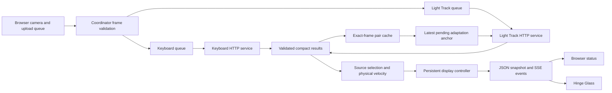
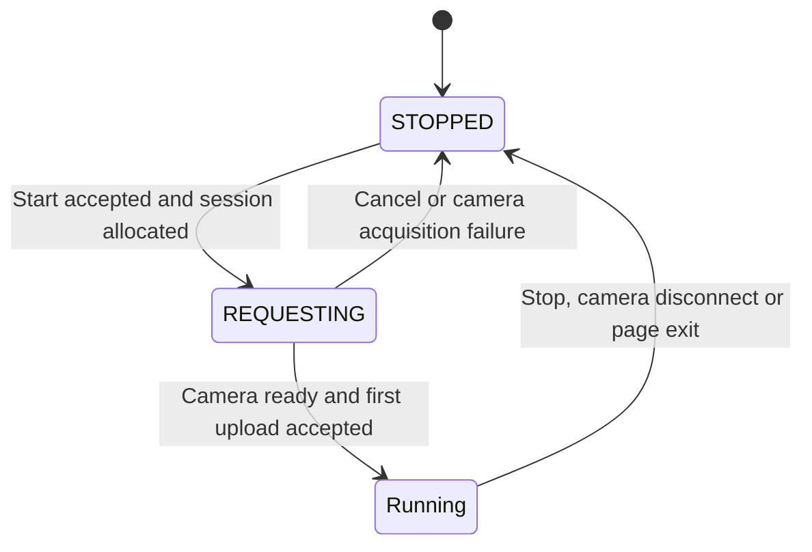
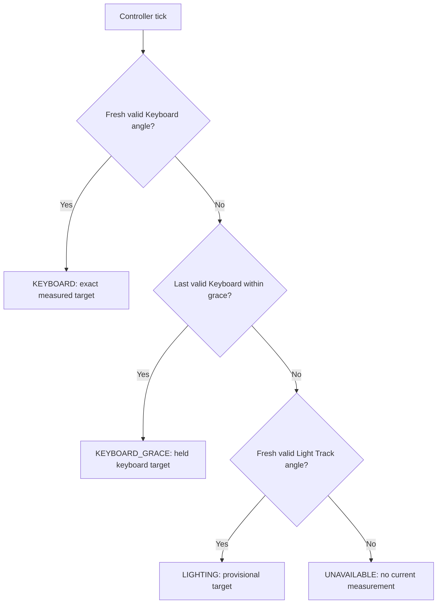
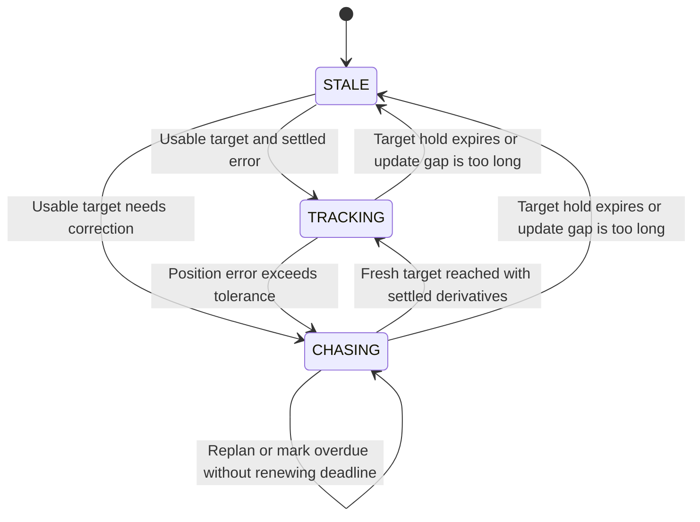

# Fusion architecture

Fusion connects one browser camera to independent Keyboard and Light Track services, selects an angle measurement, and publishes smooth display motion. It owns orchestration and controller state; Light Track owns photo training and saved models, and Hinge Glass owns rendering.

## Components and data flow

The browser opens the webcam and provides RGBA8 pixels, capture time, frame ID and available camera settings. The coordinator serves the UI, owns one camera session, validates uploads and maps browser timestamps onto its monotonic clock. Independent HTTP clients acquire service leases and serialize requests. Each upload/service queue retains one running request and only the newest waiting frame, so a slow image model cannot block keyboard output.

The source selector determines measurement authority and physical velocity. The display controller owns the continuous trajectory. A default 60 Hz timer advances it independently of the default 15 fps capture; angle events are rate-limited by the configured publication interval. Slow SSE readers are disconnected rather than accumulating output.

## Startup and camera session

The launcher verifies an existing coordinator before starting dependencies. It reuses compatible healthy services, starts missing ones with their own runtimes and configurations, and polls readiness with a bounded backoff. Occupied incompatible ports, missing runtimes or readiness failures stop startup. Shutdown and child-process failure clean up only processes created by that launcher.

The following diagram describes the camera session lifecycle. `STOPPED` and `REQUESTING` are snapshot states; after the first frame, the snapshot's `state` comes from source selection below.

Camera geometry comes from Keyboard health when supplied, otherwise Light Track health or Fusion defaults. The browser requests exact width and height and rejects a different delivered resolution. A saved profile must match width, height and field of view. An incompatible startup profile produces a visible error and a lighting session without model measurement; keyboard processing can continue.

Only one coordinator session can be active. A second start receives 409 unless the existing session has exceeded the idle lease threshold; the new start then closes it. This replacement check runs on start, not on a periodic expiration timer. Cancelled browser attempts release camera tracks even if permission resolves late. Service leases also reject competing consumers such as Keyboard-assisted photo collection.

Uploads must use the current session ID, exact RGBA byte count and dimensions, strictly increasing frame IDs and nonnegative increasing timestamps. Clients accept replies only for the requested service session, frame and timestamp and an eligible lighting generation. Per-source timestamp ordering prevents a late result from replacing a newer one. A processing timeout retains service ownership; an explicit expired-session response causes reconnection on later frames.

## Measurement selection

Source selection evaluates these rules in order on every controller tick. Freshness is measured from capture time, not response arrival.

Defaults allow 500 ms source freshness and a 200 ms keyboard grace measured from the last valid keyboard capture. Grace is not an extra 200 ms added after freshness expires. Only `KEYBOARD` sets `authoritative: true`; grace is explicitly held and provisional. An identity rejection cannot contribute a new target or anchor, although an earlier accepted reading can still remain within grace.

Keyboard velocity uses robust slopes from enough contiguous keyboard observations; if unavailable, input velocity is zero. Neither scene motion nor sample-age extrapolation alters a keyboard target, including a retained target. Light Track motion can drive a lighting fallback or a retained lighting target. Source/model changes are never differentiated into physical velocity.

`measurementAngleDeg` is the currently selected measurement, `targetAngleDeg` is the controller feedback target, and `displayAngleDeg` is the animated output. Measurement age, held flags and source quality distinguish a current measurement from a retained value.

## Display controller

The physical-motion path filters velocity through three stages with a combined 120 ms mean delay. A separate seventh-degree correction trajectory joins position, velocity, acceleration and jerk continuously. Ordinary replanning and profile/source changes preserve these derivatives. Physical-range clamping and stale freezing are explicit continuity exceptions.

Corrections larger than the default 1° tolerance start a one-second deadline. Initial candidates end within 950 ms; replanning keeps the original deadline. Preferred speed, acceleration and jerk limits choose comfortable trajectories where possible, but deadline pressure may exceed them. An expired deadline is reported, and smooth recovery continues without hiding the miss by restarting the countdown.

When source selection is `UNAVAILABLE`, the controller can retain its previous target through the 500 ms display-hold window measured from that observation. Beyond the hold, or after a controller update gap over 500 ms, it freezes at the current display angle with `controllerState: STALE`. Thus source availability and controller state can differ. The initial 120° display value is not a measured starting angle.

## Models and temporary adaptation

Light Track's annotation page saves measured photos, trains annotation models and publishes evaluated image models or scene profiles. Fusion lists these published artifacts through the profile API. A profile selected while stopped becomes the saved selection; a live change is validated by Light Track and applied on its next frame. Fusion invalidates its previous lighting result, and clients reject older model generations. Light Track clears its inference cache and adaptation anchors when the new generation activates. The display controller remains continuous.

Fusion matches compact results by frame ID and exact timestamp. A valid Keyboard match supplies a temporary adaptation anchor carrying the lighting model generation. Light Track checks its own cached frame, generation, lighting usability and anchor range before fitting. The current anchor range is 10–45°, independently of Keyboard's advertised measurement range; a valid 46° reading can drive Fusion while being rejected as an adaptation anchor. Anchor errors do not block the keyboard queue or publish training labels.

Temporary adaptation never overwrites a base model or scene profile. Photo annotation is the training/calibration workflow; unsupported calibration, recording, checkpoint and reference API routes return 410 with an annotation-page pointer. Existing saved artifacts remain loadable and exportable. Historical recording replay is read-only analysis.

## Interfaces, storage and configuration

| Interface | Purpose |
| --- | --- |
| `/api/health` | Coordinator identity, effective configuration and independent service health |
| `/api/start`, `/api/stop`, `/api/frames` | Camera-session ownership and validated RGBA uploads |
| `/api/angle`, `/api/events` | Latest display snapshot; `angle`, `service` and `stopped` events |
| `/api/profiles`, `/api/profile`, `/api/profiles/:id/export` | List, select and download Light Track artifacts |
| `/api/adaptation` | Export the current Light Track correction for diagnostics |

Fusion binds to loopback, rejects cross-origin browser requests, bounds request bodies and uses service timeouts. It persists no camera frames, models, training timeline or display recording. Its in-memory pair cache defaults to 256 entries; service feature vectors are discarded before storage. Light Track owns persistent artifacts and selected-profile state. Explicit browser downloads use Blobs and release their object URLs.

[config.json](../config.json) owns service locations, camera defaults, queue/lease limits, source timing, controller bounds and output cadence. The launcher uses the configured sibling directories and each project's runtime. A root clone alone does not contain the ignored Keyboard/Light Track repositories or local models.

Tests cover camera cancellation, exact pairing, identity rejection, original successful source paths, conflicting scene motion, stale generations, queue bounds, missing-read coverage and controller boundaries. Independent trajectory controls and counterexamples are described in [technical design](../../docs/technical-design.md) and [keyboard-target validation](keyboard-target-validation.md). Simulated frames and model fixtures establish software behavior, not physical angle accuracy. Current verification and previous changes are in [iteration history](iteration.md).
