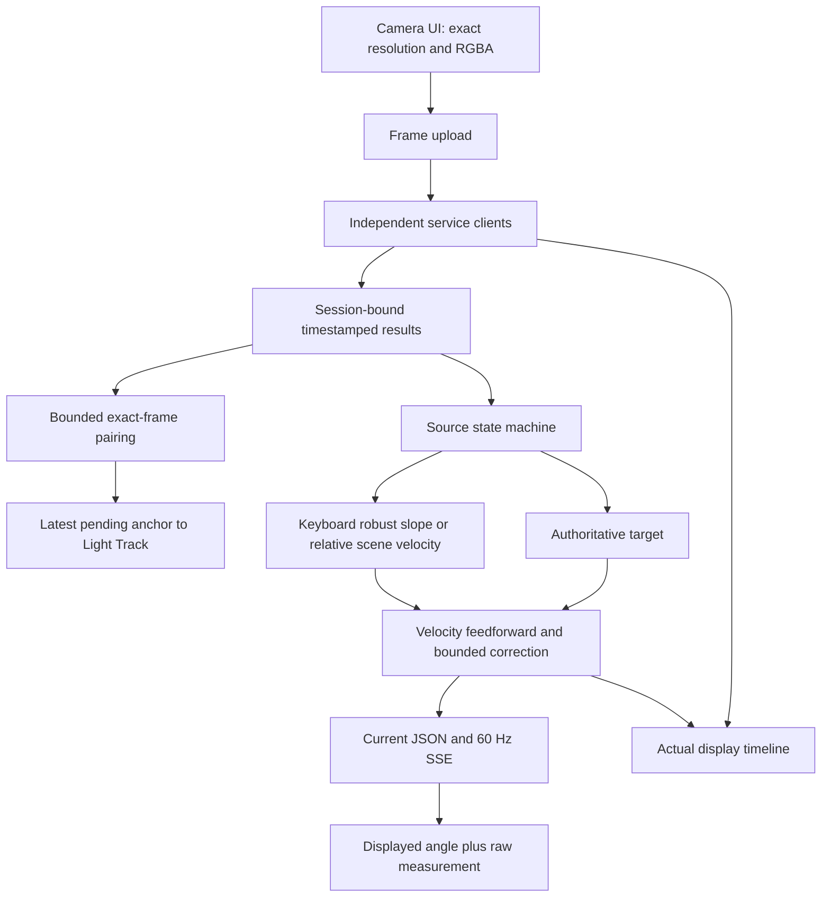
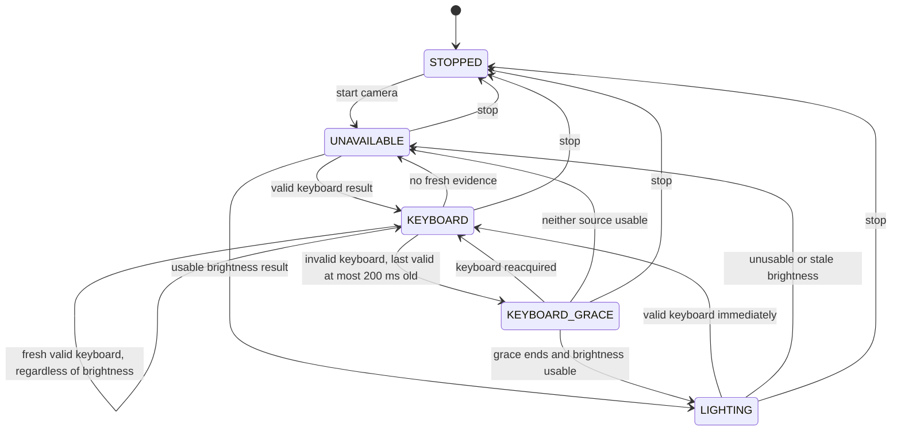

# Fusion architecture and workflows

`FusionEngine.ingest()` accepts increasing capture timestamps independently for each source. Keyboard validity comes from the service; the fusion layer never compares its value against brightness to accept/reject it. A valid sample is authoritative until superseded or stale. An explicit loss gets a 200 ms grace period from the last valid capture. Samples older than 500 ms never become a current measurement.

`DisplayController.update(target, motion, timestamp)` carries angle, filtered motion, and a bounded correction state. It integrates in at most 8 ms substeps using elapsed time. Missing targets or stale gaps freeze position and clear velocity/correction without replacing the display angle. Resuming uses the existing angle. Clamping occurs only at the displayed physical limits. Control constants reside in `config.json`.

The capture clock is aligned once to coordinator monotonic time on the first uploaded frame; frame IDs and timestamps strictly increase. The UI publishes at the configured camera rate, keeps one upload active plus one latest waiting upload, and does not use its preview canvas as an input. Each service client independently holds one request and one latest pending frame. Failed/expired leases can reconnect, while timeouts retain the active service's lease and do not overtake its worker operation.

The `/api/events` stream contains session-bound angle and source events. Slow SSE readers are closed to prevent an unbounded network buffer and can reconnect. `/api/angle` supplies the same latest output for local applications. Recording and adaptation exports are explicit and bounded; stopping the session clears server-side state.

```mermaid
flowchart LR
    Source[Separate full-range recordings] --> Split[Training / validation / test recording IDs]
    Split --> Train[Light Track training function]
    Train --> Model[Frozen source forest and motion calibration]
    Model --> New[New environment with provisional 120 degree start]
    New --> Online[Matched keyboard anchors after current prediction]
    Online --> Temporary[Bounded temporary adapter]
    Temporary --> Export[Export features and real display timeline]
    Export --> Replay[Causal replay and independent reference scoring]
```

