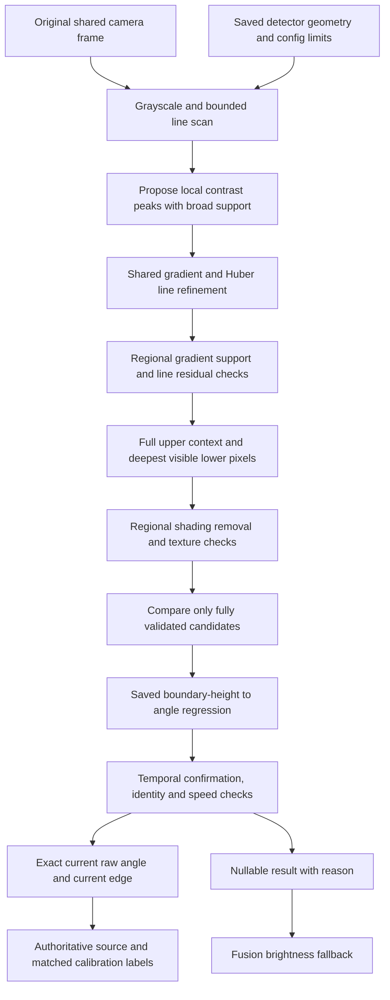
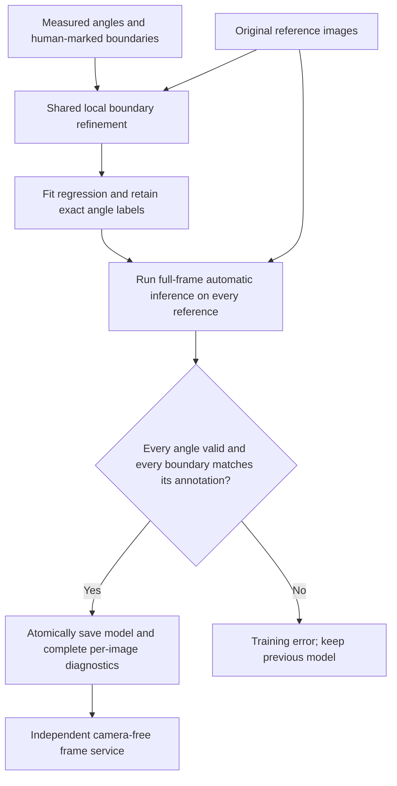
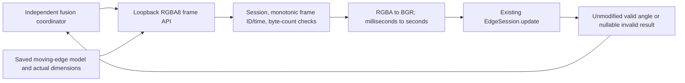
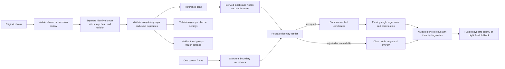

# Architecture

## Automatic recognition and visible-strip evidence (0.6.2)

`EdgeDetector` proposes local maxima over nine slope hypotheses in the saved image band. Candidates are processed in contrast order with a configurable budget (64 by default). An invalid candidate is discarded and the next proposal is considered. Ambiguity requires two fully validated lines at distinct heights with comparable strength; raw background peaks cannot create ambiguity by themselves. Hints only restrict the scan and do not bypass validation.

Frame preparation and local gradient/Huber refinement are shared by automatic detection and annotated fitting. Refinement observes a guard pixel on either side of its approximately three-pixel search radius. A gradient peak beyond that radius cannot masquerade as a clipped endpoint. At least 60% of column samples in each horizontal region must support the local gradient. By default, 90% of supported points must be within two processing pixels of the fitted straight line. Geometry is verified before testing context or choosing the winner.

`boundary_evidence` compares unmodified intensities about 10 and 16 pixels above the candidate with pixels below it. For each sampled column, lower depth is the smaller of the desired depth and the distance to the last real image row. At least four lower pixels must remain at 640×480; no missing pixels are synthesized. A cropped strip therefore supplies real asymmetric evidence instead of failing a fixed lower-band requirement. Both upper probes still require the expected polarity, minimum contrast and sustained contrast relative to the local edge.

Surface texture is measured separately in the four horizontal support regions after subtracting a linear/quadratic brightness trend in each. This permits localized shading on a reflective laptop while retaining tests for textured transitions. Contrast and regional support are computed from the original intensities. These are structural checks, not semantic object identification; visually similar scenes may remain ambiguous.

## Training acceptance and data provenance

A local annotation can initialize fitting, but it cannot authorize runtime validity or hide a detection failure. After regression, the trainer calls the normal full-frame prediction path without annotation hints on every photo. It compares both ends of the detected line over the detector's sampled width with the annotated line. The default tolerance is 1% of image height (4.8 pixels at 640×480). Every photo must produce an in-range angle and match its boundary; a wrong but numerically valid angle is insufficient. The CLI saves only after this requirement passes.

`validation.boundary_refinement` records the fitting source and annotated/refined height. `validation.automatic_detection` records the detected angle, nullable angle error, boundary-position error, recognition status and matching tolerance. Regression cross-validation and recognition of fitting images remain separate diagnostics and do not certify independent accuracy. In the current eight-photo dataset, all references pass automatic recognition, including the thin strips at 43 and 46 degrees. Images and annotations are not consulted by the live service; only the saved numeric model and incoming pixels are used.

## Persistent detection state

```mermaid
stateDiagram-v2
    [*] --> Confirming
    Confirming --> Confirming: consistent candidate; fewer than three frames or 100 ms
    Confirming --> Tracking: consecutive evidence and elapsed confirmation accepted
    Tracking --> Tracking: validated boundary within retained speed constraint
    Tracking --> Lost: absent, ambiguous or unsupported boundary
    Tracking --> Unreliable: excessive motion or invalid timestamp
    Lost --> Confirming: new supported candidate
    Unreliable --> Confirming: new supported candidate
    Confirming --> Lost: evidence fails
    Tracking --> Confirming: gap exceeds 500 ms
    Lost --> Lost: no supported candidate
```

Confirming maps to `waiting_for_base`, Lost to `base_not_visible`, and Unreliable to `unreliable_pose`. Rejection clears the public result and overlay but keeps the accepted time, height and raw angle internally for 500 ms. This still constrains search and speed across brief losses. Longer gaps permit broad search followed by new confirmation. Pending observations require gaps no larger than 250 ms. Manual initialization resets identity but requires the same automatic evidence and confirmation. The accepted angle is the current model prediction, not an average of pending observations.

`GET /v1/health` identifies boundary validation revision 3 separately from the model hash. The saved model schema and independent service contract remain compatible. New config settings control minimum visible context, line residual/inlier checks, candidate budget and annotation tolerance. Local configs can omit them and receive defaults. Keyboard authority, matched-frame label eligibility, and Fusion's one-second display correction remain separate from detection quality.

## Camera-free frame service (0.5.0)

The `serve` CLI command uses `service.py` and `service-config.json`. It owns no webcam, annotations, or brightness logic. Its health response reports the intersection of model and configured angle limits and the exact model resolution. One active lease owns inference; reset generates a new ID, and expired responses cannot be used by the old owner. Processing is protected by a nonblocking lock; the coordinator maintains the bounded latest waiting frame. RGBA uploads are length-bounded and drained before ordinary rejection responses to avoid Windows unread-socket resets.

Keyboard detection and measurement rejection stay inside the existing session. The fusion layer treats a valid result as accurate and never reweights it against another estimator. Tests exercise real HTTP bodies, model resolution, timestamp conversion, invalid requests, ownership, busy handling, and reset.

## Components and data flow

~~~mermaid
flowchart TD
    CFG[Camera settings, optional measured rectangle, and limits] --> CLI[CLI]
    BROWSER[Browser front camera or image upload] --> UI[Four-corner and angle editor]
    UI --> STORE[Validated images and versioned annotation JSON]
    STORE --> SAMPLES[Shared dataset loader]
    SAMPLES --> GEO[Geometric reference fitting]
    SAMPLES --> EMP[Regularized empirical fitting]
    BOARD[Checkerboard capture] --> CAM[Camera intrinsics with distortion]
    FOV[Configured horizontal FOV: default 60 degrees] --> APPROX[Assumed intrinsics, zero distortion]
    APPROX --> GEO
    CAM --> GEO
    APPROX -. optional plane-normal features .-> EMP
    CFG --> GEO
    GEO --> HINGE[Hinge JSON bound to intrinsics and physical rectangle]
    EMP --> MODEL[Empirical model with optional FOV and training support]
    SAMPLES --> EVAL[Independent evaluation and per-image failure reports]
    HINGE --> EVAL
    MODEL --> EVAL
    WEBCAM[Screen-mounted camera] --> SELECT[Manual four-corner initialization]
    SELECT --> TRACK[Shared plane texture tracker]
    TRACK --> ESTIMATE[Pose estimation or empirical prediction]
    HINGE --> ESTIMATE
    MODEL --> ESTIMATE
    ESTIMATE --> GATE[Quality, range, speed, and support checks]
    GATE --> STATE[Runtime state machine]
    STATE --> OUTPUT[Preview and nullable JSONL]
~~~

| Component | Responsibility |
| --- | --- |
| config.py | Shared limits, angle/FOV validation, camera settings, optional measured geometry, atomic persistence |
| annotation.py / annotation.html | Image decoding, safe image identifiers, versioned labels, HTTP API, canvas state |
| capture.py | Frame acquisition, exact resolution, unmirrored preview, manual corner selection |
| calibration.py / geometry.py | Checkerboard and assumed intrinsics, IPPE candidates, fixed hinge fit, geometric angle and quality |
| uncalibrated.py | Dimensionless features, optional FOV normals, ridge fitting, support checks, empirical session |
| tracking.py | Reusable plane texture tracking, rejection states, timestamped measurement records |
| evaluation.py | Dataset fingerprint, per-image estimation, errors, independent aggregate metrics |
| cli.py | Command dispatch, mode-specific prerequisites, display, resource lifetime, JSONL logging |

Camera-only commands, annotation, empirical corner/edge fitting, and empirical evaluation load config without requiring or validating physical rectangle dimensions. Geometric fitting and live geometry require confirmed dimensions. Camera calibration and assumed FOV never become prerequisites for the FOV-free empirical path.

## Annotation workflow

~~~mermaid
stateDiagram-v2
    [*] --> Empty
    Empty --> Busy: upload / request camera
    Busy --> Ready: image decoded
    Busy --> Camera: stream available
    Busy --> Empty: load failed
    Camera --> Ready: capture uploaded / stop stream
    Camera --> Camera: capture failed / show error
    Ready --> Dirty: corner or angle or note edit
    Dirty --> Dirty: drag / undo / reset
    Dirty --> Saving: four corners and valid angle
    Saving --> Ready: atomic save succeeded
    Saving --> Dirty: validation or write failed
    Ready --> Busy: navigate / upload / camera
    Dirty --> Busy: discard confirmed then navigate
    Dirty --> Dirty: discard cancelled
~~~

The canvas uses original image pixels as its drawing coordinates. Pointer positions are rescaled from its CSS rectangle. Corner labels retain physical order: front left, front right, rear right, rear left. Pointer capture allows dragging outside the marker; coordinates are clamped inside the image. Camera capture freezes a JPEG, uploads it, releases the browser camera, and edits the resulting image. Camera selection and exact requested resolution are exposed in the UI.

HTTP routes:

| Route | Behavior |
| --- | --- |
| GET / | Packaged static page; no frontend toolchain |
| GET /api/config | Configured angle limits, corner labels, capture width/height |
| GET /api/items | Decodable images, actual dimensions, URLs, existing labels |
| GET /media/{id} | Validated image inside the dataset directory |
| POST /api/upload | Multipart file, validated byte/pixel limits, unique ID on duplicate filename |
| POST /api/annotations | JSON label; valid image, finite angle/corners, in-bounds convex perimeter, atomic update |

Annotation schema 2 keeps item_id, Unix timestamp, measured angle_deg, source, notes, and four original-image pixel corners. Version 1 remains readable, including records lacking corners; fitting rejects incomplete records with instructions to finish them in the UI. Save upgrades the document to version 2. Unsupported versions and duplicate IDs are rejected.

All consumers use the same image loader and label validation. Fitting fails with the offending image ID for corrupt/missing images, incomplete corners, or incompatible dimensions. Evaluation records these failures per image and continues. Image content hashes and annotation payloads form a deterministic fitting fingerprint. Atomic writes use a unique temporary file in the target directory, flush and fsync, then replace; annotation memory updates only after the file is committed.

## Geometric reference fitting and runtime

The physical rectangle is on z=0. Base x is parallel to the hinge from left to right; y points from front to hinge; z points out of the upper surface. OpenCV camera coordinates are x right, y down, z forward.

For opening theta, model object-to-camera rotation as **R(theta) = M · Rx(s · theta)**. M is the fixed mounting orientation and s is +1 or -1. No image at closed angle is needed.

~~~mermaid
flowchart LR
    A[Selected reference annotations] --> B[Decode images and validate corners]
    B --> C[Undistort pixels and generate IPPE pose candidates]
    C --> D[Seed mounting orientation and direction from widest-separated references]
    D --> E[Select consistent pose branch for every reference]
    E --> F[Average mount rotations using SVD projection onto SO3]
    F --> G[Recheck residuals and save camera/model-bound hinge]
~~~

References must be in the configured interval, with at least 15° separation by default. The first and last angles seed the existing two-reference calibration. For each candidate and sign, compute **Mi = Ri · Rx(-s · thetai)**, choose consistent mounts, and reject materially ambiguous alternatives. Extra references must agree with hinge-only rotation before all selected mounts are averaged. The artifact records all selected image IDs; evaluation excludes them from independent metrics.

At runtime, **Q = Mᵀ · R**. Extract the signed opening with atan2(Q21 − Q12, Q11 + Q22), multiplied by s. Only one equivalent 360° mapping may lie in the configured opening interval. Full rotation distance to M · Rx(s · theta) checks off-axis motion. Positive camera depth and **dot(R[:,2], -t) > 0** require the visible upper surface.

~~~mermaid
flowchart LR
    P[Plane/image correspondences] --> U[Undistort and RANSAC homography]
    U --> I[IPPE candidates]
    I --> V[Depth, upper side, area and reprojection]
    V --> H[Signed hinge angle and residual]
    H --> Q[Range, speed, candidate quality and ambiguity]
    Q --> R[Estimate or unavailable]
~~~

An inferior in-range pose cannot replace a candidate with materially better reprojection that failed range, hinge, or speed checks. The current model constrains rotation; it does not fit a physical hinge pivot from translations.

## Empirical fitting with optional FOV

At least four images and three distinct measured angles are required. The base feature vector is eight centered corner coordinates divided by one RMS spatial scale. This removes image translation and uniform scale while retaining aspect ratio and orientation.

FOV assistance is optional. Configuration selects it through **uncalibrated.use_fov**, and training flags can enable it, disable it, or override horizontal FOV. When enabled, the shared approximate-camera builder computes **fx = fy = width / (2 tan(horizontal_FOV / 2))**, a centered principal point, and zero distortion. Solve K · B = H for the unit-rectangle image homography H. Normalize the cross product of B's first two columns to obtain three extra plane-normal features. Unknown rectangle width/depth multiply the columns but do not change the normal direction. No physical measurements or camera file are required.

~~~mermaid
flowchart TD
    A[Valid labeled photos] --> B[Centered and RMS-normalized corner coordinates]
    A --> C{Optional FOV enabled?}
    C -->|Yes| D[Approximate K and rectangle homography]
    D --> E[Dimensionless plane normal]
    E --> F[Standardize feature vectors]
    B --> F
    F --> G[Ridge regression, intercept unpenalized]
    G --> H[Persist coefficients, normalization, support shapes and training angles]
    F --> V[Leave every image at one angle out together]
    V --> METRICS[Cross-validation errors and warning threshold]
    METRICS --> H
    H --> P[Same feature extraction at runtime]
    P --> CHECK[Support envelope and training-angle checks]
    CHECK --> RESULT[Approximate angle or unavailable]
~~~

Feature standard deviations have a small floor to avoid dividing by numerical noise. Ridge strength defaults to 0.01. The model stores the standardized training shapes in angle order. Prediction requires per-coordinate support bounds and proximity to the piecewise linear path through those shapes; the default standardized margin is 0.3. This is a conservative shape support heuristic, not a learned occlusion detector.

Output must also lie in the training label interval intersected with current configured limits. Predictions outside that interval are rejected rather than extrapolated or broadly clamped. Slight regression bias can therefore make endpoint photos unavailable; evaluation reports such failures. The confidence heuristic combines feature support, tracking inlier ratio, and reprojection consistency.

Leave-one-angle-out diagnostics fit normalization and regression from each training fold only. Raw fold predictions include endpoint extrapolation to expose model behavior; this diagnostic does not bypass runtime support checks. The default 5° mean-error threshold prints a warning without claiming an accuracy guarantee. Independent image evaluation remains necessary.

Empirical model schema 1 contains a feature version, optional horizontal_fov_deg, image size, configured and training ranges, mean/scale/coefficients, support vectors, winding, selected image IDs, dataset fingerprint, and diagnostics. Runtime uses the saved FOV, not the current config FOV; changing FOV requires refitting. Model loading validates dimensions, finite coefficients, ranges, version, and metadata.

## Shared live tracking and state machine

Both modes use the same Shi–Tomasi interior features, Lucas–Kanade flow, forward/backward checks, minimum feature count, and drift deadline. Geometric tracking maps pixels into the measured plane after lens correction. Empirical tracking uses a unit rectangle and an identity pixel adapter; its RANSAC homography reconstructs the four image corners from tracked interior texture. FOV assistance affects empirical prediction, not optical-flow tracking.

~~~mermaid
stateDiagram-v2
    [*] --> WaitingForBase
    WaitingForBase --> Tracking: S / valid selection and texture
    WaitingForBase --> UnreliablePose: rejected selection
    Tracking --> Tracking: valid flow, geometry or empirical prediction
    Tracking --> BaseNotVisible: lost texture, resolution error or drift deadline
    Tracking --> UnreliablePose: invalid shape, unsupported range, ambiguity or speed
    BaseNotVisible --> Tracking: S / valid reselection
    UnreliablePose --> Tracking: S / valid reselection
    BaseNotVisible --> UnreliablePose: rejected reselection
    Tracking --> [*]: quit
    WaitingForBase --> [*]: quit
    BaseNotVisible --> [*]: quit
    UnreliablePose --> [*]: quit
~~~

Every rejection clears the displayed angle, confidence, corner overlay, temporal history, and tracker. Corner tracking does not resume automatically; moving-edge detection has independent reacquisition as described below. No features are replenished and a configurable 30-second deadline forces a fresh manual anchor. The CLI writes a final invalid JSONL record on camera failure and closes camera/window/file resources.

Records contain monotonic timestamp, state, mode, nullable angle, confidence, reason, and geometric residuals when applicable. The confidence score is not calibrated uncertainty.

## Evaluation, compatibility, and verification

Evaluation shares image validation and prediction with runtime. Per-image rows include expected/estimated angle, absolute error, reason, and whether the image was used for fitting. Failed images remain in the denominator. Aggregate metrics exclude fitting IDs by default and include success/failure counts, mean, median, maximum error, and worst cases. --include-training explicitly includes fitting errors. Legacy hinge files without IDs remain readable and emit a validation-independence notice.

Camera JSON retains its existing matrix/distortion/image_size interface and adds source metadata. Hinge JSON retains mount/sign, camera fingerprint, physical points, and reference angles, with optional reference IDs. Approximate FOV changes alter the intrinsic fingerprint and invalidate geometric hinge fits. Existing wide-angle geometry tests specify explicit 0–180° limits; new workflow tests exercise default 10–45° endpoints, rejection, empirical modes, and camera-free prerequisites.

Tests cover dataset migration, malformed payloads/images, atomic failures, API routes, model persistence, held-out metrics, FOV precedence, geometric fitting, branch rejection, rendered tracking loss/recovery, and CLI workflows. Browser verification covers original-pixel selection, dragging, saving, navigation, and reload persistence. Camera opening at the saved model resolution was checked on hardware; real angle accuracy still requires independent hardware validation.

## Moving boundary mode: two endpoints, no complete keyboard required

The cropped visible base is not a fixed physical rectangle. Its intersections with the photograph borders move over the surface as the lid opens, so the earlier homography-normal and optical-flow corner assumptions do not apply. The new method instead uses the height of the moving boundary above the visible base in the lower half of the image. The fixed photo bottom cannot encode an opening angle.

Configuration selects uncalibrated.method: edge. The UI offers Moving boundary (2 points), requiring left-to-right endpoints and a measured angle. It draws a line and enables save after two clicks; physical rectangle mode still uses four clicks. Schema 2 adds corner_mode: visible-edge and edge: two pixel points, with corners: null. Existing schema 1/2 physical records remain readable. Explicit edge fitting can consume the first two points of older cropped quadrilaterals. Geometric fitting rejects explicit edge records.

~~~mermaid
flowchart TD
    A[Two endpoints and measured angle per photo] --> B[Validate broad horizontal boundary in lower half]
    B --> C[Learn search height interval, slope interval and contrast direction]
    C --> D[Refine labeled line from image intensity transition]
    D --> E[Fit height-to-angle ridge regression with optional FOV viewing angle]
    E --> F[Anchor fitted outputs at measured extremes]
    F --> VERIFY[Require automatic recognition matching every annotation]
    VERIFY --> M[Moving-edge model: detector settings, range, FOV, coefficients, diagnostics]
    CAM[New camera frame] --> SEARCH[Search lower-half band, narrowed by last accepted position]
    M --> SEARCH
    SEARCH --> Q[Local contrast peaks and column support]
    Q --> LINE[Refine candidate lines and check straightness]
    LINE --> CONTEXT[Sustained contrast, regional shading and visible lower strip]
    CONTEXT --> ID[Optional identity verifier per candidate]
    ID --> COMPARE[Reject comparable fully validated competing boundaries]
    COMPARE --> PRED[Angle, range and speed checks]
    PRED --> OUT[Line overlay and nullable angle]
~~~

The detector downsamples large images to at most 640 pixels wide, samples 64 columns, and evaluates nine small slope hypotheses across a bounded height interval. A robust quantile of above/below intensity differences proposes local peaks. Huber fitting and geometric/context checks validate candidate lines before ambiguity is considered. An invalid high-scoring line does not terminate the search. It does not use optical flow, keyboard corner identity, or physical dimensions.

The regressor uses normalized image height and optionally atan((y-cy)/fy), where fy is obtained from the shared approximate intrinsics builder and configured horizontal FOV. FOV is optional and persisted in the model. No plane normal is inferred from the clipped outline. Regression endpoints are anchored to the measured extremes to prevent tiny ridge bias from invalidating endpoint photos; predictions beyond the captured height or angle interval still reject. Leave-one-angle-out diagnostics fit each fold separately. Per-image evaluation executes detection on the image, not just prediction from manual endpoints.

The moving-edge artifact has its own type and version and stores image resolution, coefficient normalization, training angle/position range, detector scan limits, slope range, polarity, thresholds, training IDs/fingerprint, and validation results. Existing empirical corner model files remain supported by a shared model reader. The CLI chooses the matching runtime session from the saved model type.

~~~mermaid
stateDiagram-v2
    [*] --> Searching
    Searching --> Tracking: three consecutive supported frames spanning 100 ms
    Tracking --> Tracking: supported edge near previous height
    Tracking --> Lost: missing, weak, ambiguous or out-of-range edge
    Tracking --> Unreliable: excessive motion
    Lost --> Searching: supported candidate; retain recent identity constraint
    Unreliable --> Searching: supported candidate; retain recent speed reference
    Searching --> Searching: no supported edge
    Lost --> Searching: S / two endpoint search hint
    Tracking --> Searching: S / two endpoint search hint
    Tracking --> [*]: quit
~~~

Every rejected edge clears the public line, angle, and confidence. Internal accepted identity survives brief loss for 500 ms; after expiry, subsequent frames can search the full learned interval and confirm acquisition again. S selects two endpoints on a frozen frame to guide an ambiguous search. This mode recognizes a boundary and surrounding surface pattern, not the semantic identity of a keyboard; visually similar objects remain a limitation.

For both uncalibrated model types, live startup copies the saved model's image dimensions into the capture request instead of comparing the model against unrelated config dimensions. A mismatch prints both sizes. Actual frames must match the model; no silent resize or crop is performed. The reusable camera opener reports the requested/required dimensions without falsely calling an empirical model a calibration file. Annotation capture still uses configured dimensions.

## Optional object identity and reviewed data

The verifier returns `accepted`, `rejected` or `unavailable`, scores and a reason. Identity runs before ranking, so a rejected strong edge cannot hide a weaker verified edge. Temporal persistence never bypasses identity. Each accepted frame still passes the normal angle/range/speed checks and reacquisition confirmation. No angle filter is added. Disabled verification preserves the structural detector; this remains the default until independent evaluation passes promotion.

DINO uses aspect-preserving patch features and compares foreground against reference backgrounds in four screen regions. Masks contain only real pixels below/above the annotated moving boundary; padding supplies no support. Cache keys include image hash, weights, extractor/source versions, processing size and backend. Per-reference prototype limits bound matching work as the dataset grows. PerSAM uses reference-conditioned masks; YOLO uses semantic boxes aligned with structural boundaries. Both still require the existing edge checks. Models load once per service, frame buffers are released after inference, and the service rejects concurrent work rather than queuing camera frames. Missing assets fail as unavailable. Local CLI and service share the same verifier interface.

```mermaid
stateDiagram-v2
    [*] --> Searching
    Searching --> Confirming: fresh identity and supported edge
    Confirming --> Tracking: normal multi-frame confirmation
    Confirming --> Lost: identity rejected or unavailable
    Tracking --> Tracking: fresh accepted evidence
    Tracking --> Lost: invalid edge, identity loss or stale frame
    Lost --> Confirming: fresh identity evidence
    Lost --> Lost: no supported evidence; null output
```

Identity annotation saves are serialized under the existing store lock, atomically replace a separate sidecar, and reject obsolete revisions. Angle and identity edits have independent dirty snapshots. Neither saving identity nor exporting datasets rewrites angle manifests. Export validates image hashes, dimensions and endpoints; complete groups and exact duplicates stay in one role. Ambiguous images remain recorded but do not count as positives or negatives. Reference leave-one-out results remain diagnostics; only sufficiently populated held-out groups can establish promotion evidence.
