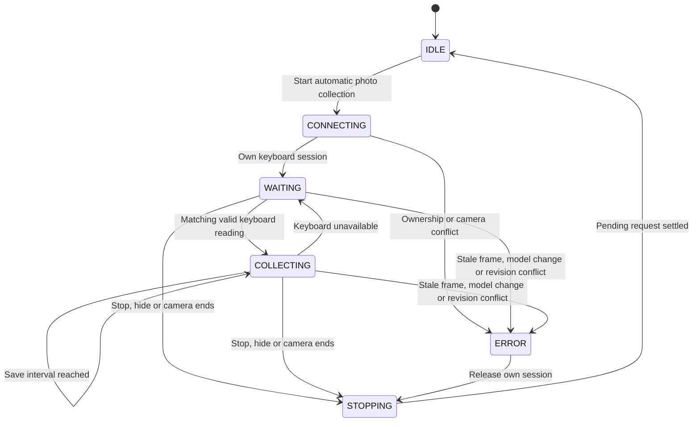
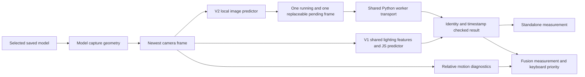
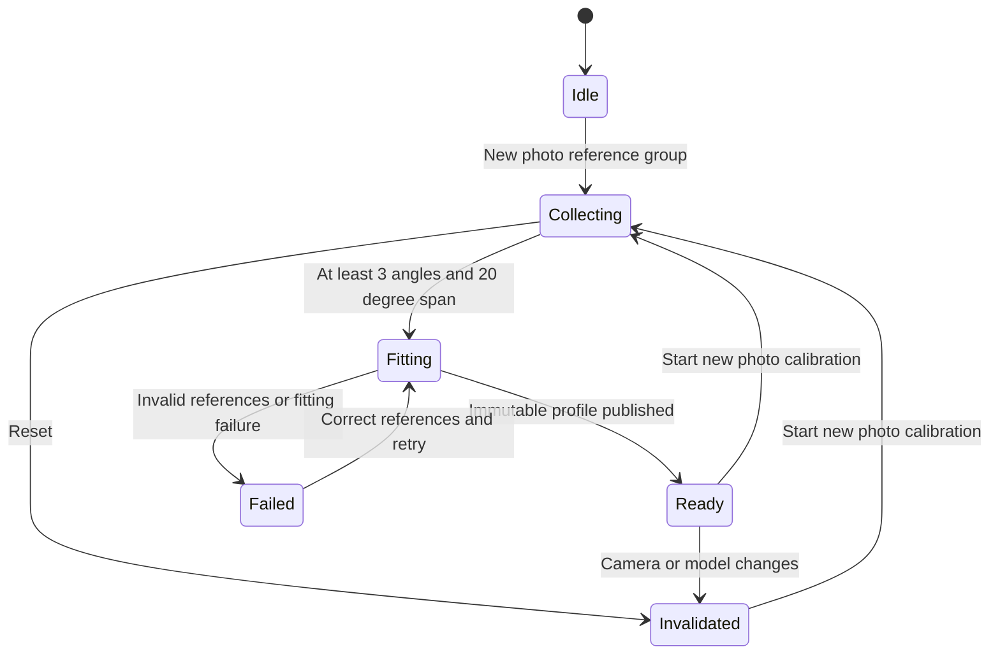
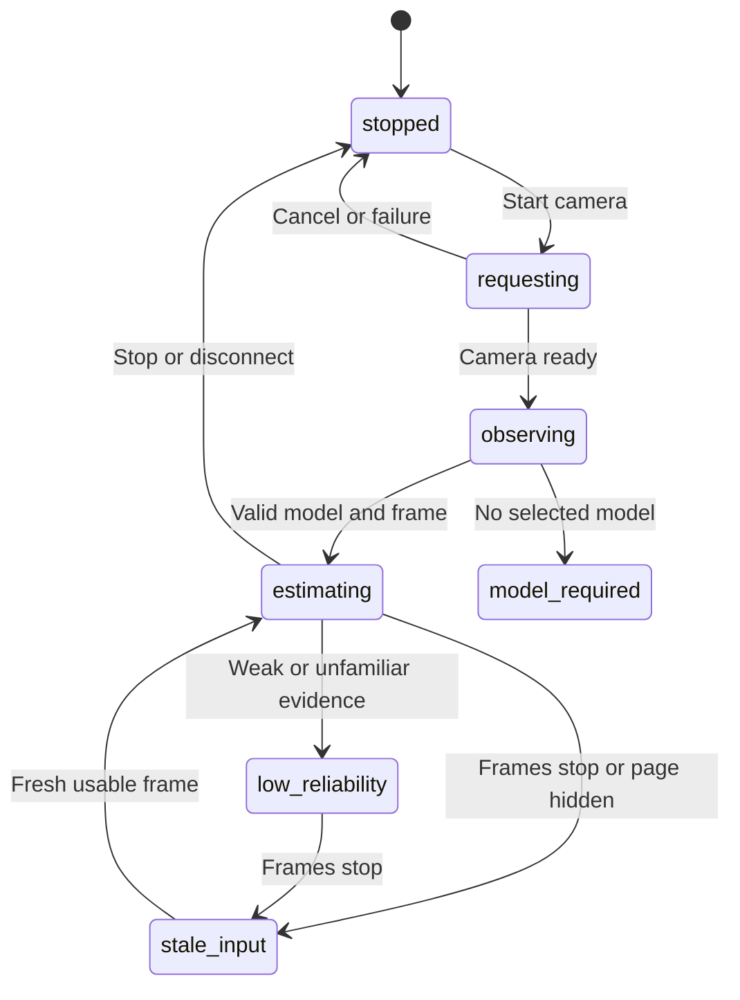

# Light Track architecture

## Data and training

```mermaid
flowchart LR
  Camera[Camera or uploaded photo] --> Frame[Pixels and capture metadata]
  Frame --> Manual[Actual measured manual angle]
  Frame --> Keyboard[Exact matching frame to Keyboard]
  Keyboard --> Gate[Valid identity, model, time and range]
  Manual --> Store[Revision checked annotation group]
  Gate --> Store
  Store --> Photos[PNG, label, features and provenance]
  Photos --> Train[Closed groups: train or evaluate image model]
  Train --> Checks[Whole-group evaluation and export parity]
  Checks --> Model[Immutable annotation model]
  Photos --> Scene[Separate scene references plus base model]
  Scene --> Profile[Immutable scene profile]
  Model --> Select[Standalone and saved profile selectors]
  Profile --> Select
```

Photo annotation is the only training and calibration input. Manual labels record the measured angle; keyboard labels require the exact saved pixels, frame ID, timestamp, camera and reported model range. Shared label validation, schema, metrics and tree export live in `research/model_training.py`. Existing PNGs and manifests need no migration. Model/profile loaders retain compatibility with existing published artifacts; legacy recordings can be exported but have no training entry point.

## Camera and collection workflow

The browser submits one Keyboard request at a time. The service serializes annotation mutations and grants usage leases for collection, training and scene fitting. Deletion requires one confirmation, rejects obsolete revisions, journals the PNG removal, and uses atomic manifest replacement as the commit point. Restart rolls back an uncommitted deletion or finishes committed file cleanup. Published artifacts are outside the deletion transaction. Offline CLI training requires stable inputs because its process does not share server leases.

## Live inference

The live page has one estimator workflow: saved photo-model inference. Preview visibility does not change processing. Model changes reset estimator state; stale input has no current displayed angle. Image worker backend and time are explicit. The worker transport retains its occupied slot after a timeout until the actual response arrives. Missing optional assets fail explicitly. Relative motion supports the existing Fusion controller but never supplies a new absolute-angle reference or trains a model.

## Scene profiles and live states

Suggested reference angles are guidance only. Affine scene fitting uses actual annotated labels and preserves the base model. Scene reference images are fitting inputs, not independent validation. New photos at different angles are required for physical acceptance.

## Interfaces

`/annotations/api/groups` manages photo groups, screenshots, labels and per-photo deletion. Group `collection` endpoints implement keyboard-labeled photos. `/annotations/api/training` trains annotation models; scene endpoints fit annotated reference groups. `/v1/sessions` accepts live frames, keyboard adaptation anchors, reset, profile selection and adaptation export. `/v1/profiles` lists, selects, loads and exports saved artifacts. `/tracking/*`, legacy recording/checkpoint/reference/training session actions and old `/v1/jobs/*` return 410. The retired sweep and feature-recording trainers are absent.

Shared settings remain in configuration. Research methods, frozen model sources, cache provenance, accuracy gates and remaining scene limitations are documented in [scene-model-research.md](scene-model-research.md) and [annotation-model-research.md](annotation-model-research.md).
