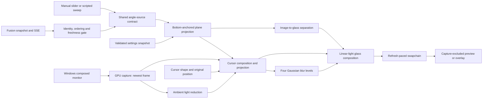
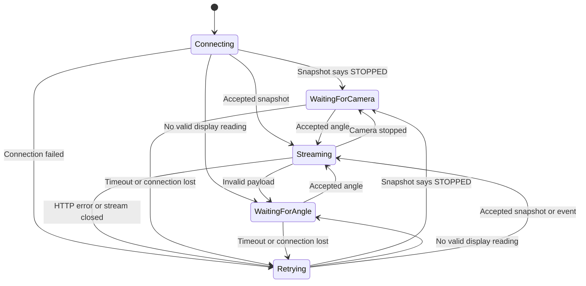
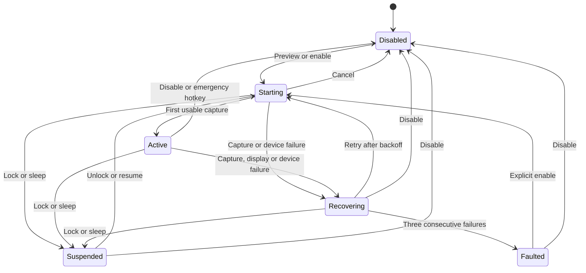

# Hinge Glass architecture

Hinge Glass is a native Windows desktop animation. It captures a composed monitor, rotates a virtual desktop plane about the active bottom edge, and adds frosting according to the plane's distance from the glass. Manual and scripted angles work independently; Fusion can supply its already-smoothed display angle. The renderer neither owns the camera nor changes estimator output.

## Components and data flow

| Component | Responsibility |
| --- | --- |
| UI thread | Controls, settings, source selection, emergency hotkey and power/session notifications |
| Render thread | D3D device/context, capture polling, projection, blur, presentation and recovery |
| Fusion worker | Cancellable loopback HTTP, incremental event parsing and angle validation |
| Cursor guardian | Restore system-cursor visibility if the renderer exits unexpectedly |

Settings snapshots and angle-source ownership cross the UI/render boundary under a mutex. Capture callbacks signal frame availability; the render thread owns GPU work. The capture adapter and render adapter may differ, so Windows can perform a cross-adapter transfer. Telemetry distinguishes capture delivery, GPU processing and presentation rather than attributing them to one latency number.

## Angle transport and freshness

Fusion connections start with `/api/angle`, then subscribe to `/api/events`. The worker consumes available HTTP bytes promptly and incrementally parses bounded messages, including fragmented events. EOF, timeout and HTTP errors trigger a new snapshot and subscription after the configured retry interval.

Network state and angle freshness are independent. A streaming connection can carry a retained `STALE` controller value. Accepted Fusion payloads require an angle in 10–120°, finite displayed velocity and timestamps, a nonempty session, and a recognized controller state. Duplicate/reordered timestamps and retired sessions are rejected across reconnections. A camera stop retires the previous session.

Prediction uses only Fusion's displayed velocity for at most the configured 17 ms horizon. A disconnected, stale or overly old reading freezes geometry while capture remains live. The default freshness timeout is 500 ms. Controls sample the angle source even while rendering is disabled and show the connection address and status.

Manual/debug is the default source; selecting Fusion or launching with `-Fusion` enables the worker. Editing the manual angle deliberately selects manual input. A Fusion-address change creates a connection for the new loopback endpoint. The Fusion range does not include full 0° closure; manual/debug input spans 0–180°.

## Projection and frosting

Preview, live overlay, synthetic grid and benchmarks all use one projection. The virtual desktop keeps its width and height while rotating by the difference between reference and input angles. Its entire active bottom edge is fixed. A centered viewer casts rays through the stationary output plane onto the virtual plane; the resulting homography maps output pixels to source coordinates.

At or above the reference angle the projection is identity. Back faces, edge-on singularities, behind-eye rays and coordinates outside the desktop produce ambient glass rather than flipped or invalid imagery. Preview dimensions use a uniform scale to preserve monitor aspect ratio. This is a visual desktop rotation; it does not anchor content in world space as the physical panel moves.

Frosting follows the closest distance from each visible image point to the finite glass rectangle. The hinge stays clear; points farther up become more frosted as the planes separate. Beyond 90° of relative rotation, the closest glass point is on the bottom edge, so the distance cannot shrink through the infinite extension of the glass plane. Frost amount uses a bounded exponential response; maximum blur zero disables blur and tint.

Projection and blur operate in linear light. Four reduced-resolution Gaussian levels cover increasing radii, and composition interpolates adjacent levels by variance using the local frost amount. This makes the blur footprint vary across the image. SDR output is encoded for presentation; HDR capture uses floating-point scRGB. The captured desktop is one plane, so this effect does not use object depth inside a game or video.

Independent CPU controls compare forward projection and ray intersections with inverse sampling. Separate closest-point controls and actual shader tests cover fixed-bottom geometry, singularities, reopening, reference-angle identity, zero blur and near-hinge contrast. Implementation sources are recorded in [research](research.md); test evidence is in [validation](validation.md).

## Output, controls and cursor

The full-screen output is an independent, nonactivating, click-through window excluded from capture. The controls are also capture-excluded and stay above visible output without taking focus; deliberate minimization is respected. Switching the calibration grid changes only the image source, preserving angle, geometry and output dimensions.

The render pipeline draws the cursor into virtual content before projection. Over controls, their child widgets, dialogs, popup lists and active drags, the native cursor remains visible. Elsewhere, a cursor guardian must be ready before the duplicate system cursor is hidden. Disable, suspension, recovery and normal exit restore visibility; the guardian restores it if the renderer process terminates unexpectedly. Input coordinates, focus and clicks continue to reach the original applications.

Capture retains only the newest frame. A waitable flip swapchain uses three buffers and permits at most two queued frames. Render cadence is capped by configuration and the active display refresh. Static desktops can legitimately provide few new capture frames; source-frame age alone does not establish failure. GPU timing queries use a bounded asynchronous ring.

## Lifecycle and recovery

The diagram shows normal recovery paths; exit disables rendering from any state. Resource failure hides output and restores cursor visibility before recreating the device, capture and swapchain. Three consecutive failures stop automatic recovery, leaving the native desktop visible. A successful active run resets the failure count after ten seconds. Stale angle input does not cause device recovery.

While enabled, an execution-state request prevents idle sleep. The renderer does not change power plans or Windows refresh settings. Deliberate lid sleep, firmware panel shutdown, secure desktops and protected/exclusive-fullscreen capture are outside its control. Physical lid and panel behavior require hardware verification.

## Configuration and storage

[config.json](../config.json) supplies defaults for geometry, frosting, frame cap, angle timing, monitor and adapter. User preferences in `%LOCALAPPDATA%/HingeGlass/preferences.json` override those defaults. Settings are validated before use and saved through a temporary file and atomic replacement. `--no-preferences` provides reproducible diagnostics without loading or saving user preferences.

Camera data and angle histories are not recorded by the renderer. Capture surfaces, shader intermediates, latest angle and telemetry live in memory. Explicit diagnostics save JSON reports under the chosen path; synthetic runs can also save a PNG after timing. Live desktop pixels are not written to disk.

The default test cap is 60 Hz. HDR, full-resolution game contention, physical lid behavior and 240 Hz acceptance for the current effect remain hardware checks; software present counts do not measure optical motion-to-photon delay. See [research](research.md) for sources actually used, [validation](validation.md) for measured evidence, and [workspace iteration history](../../docs/iteration.md) for dated changes.
