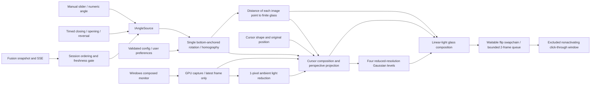
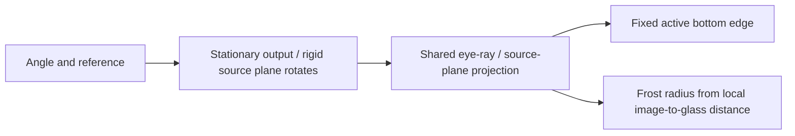
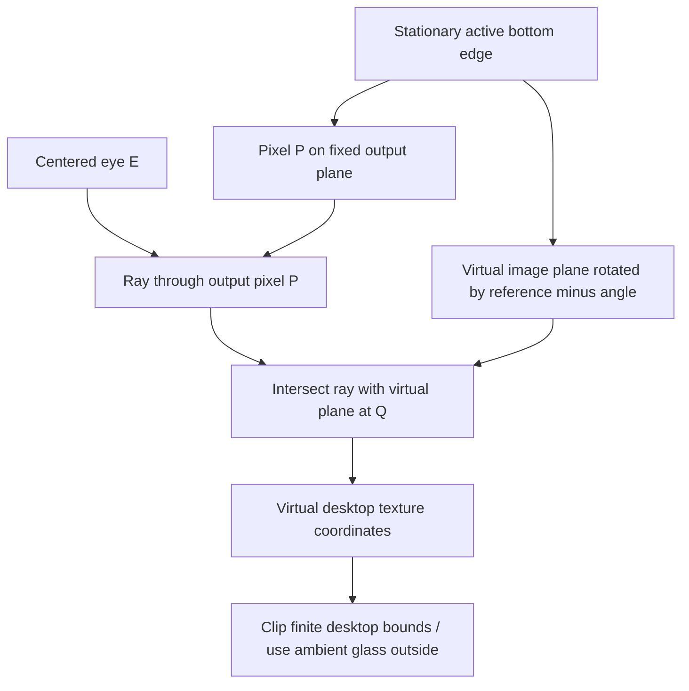
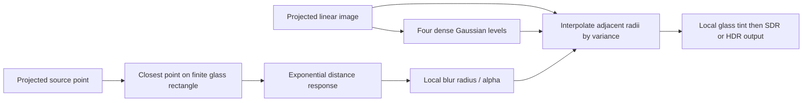
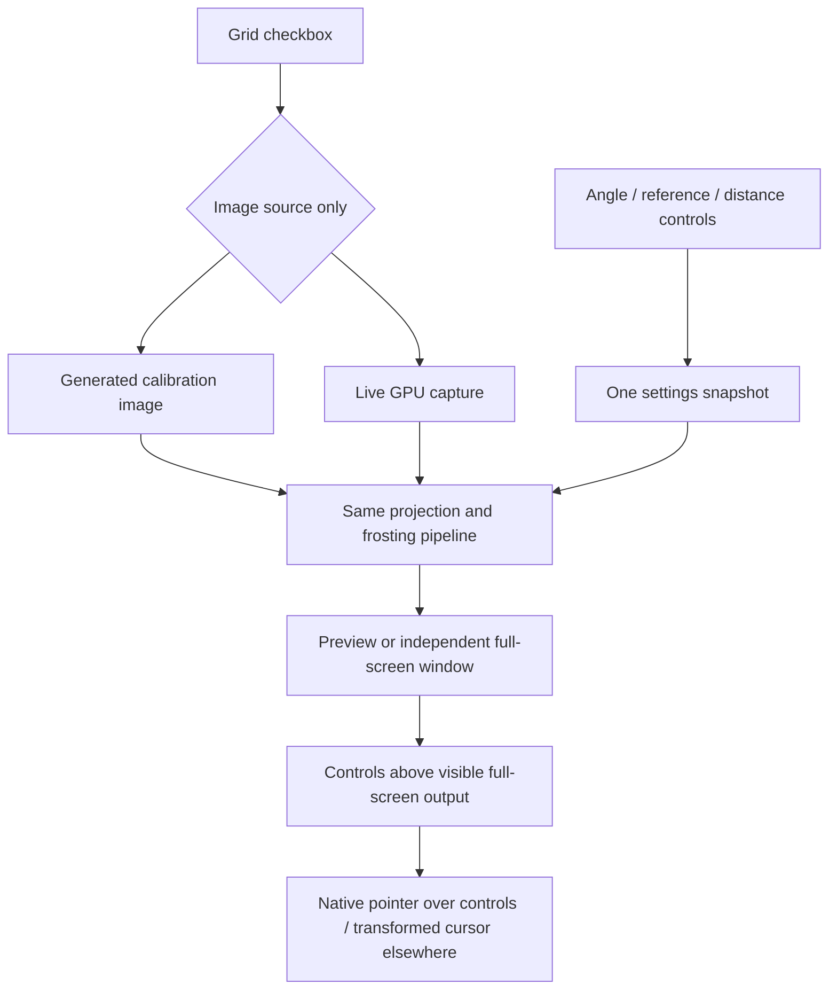
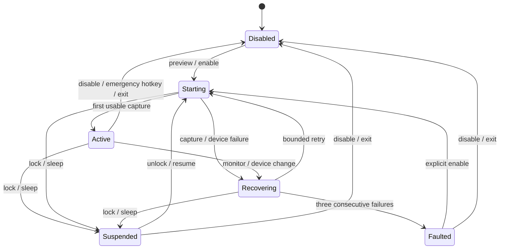

# Hinge Glass architecture

## Data flow



The UI thread owns Win32 controls, emergency hotkey and session/power notifications. A render thread owns the D3D immediate context and capture polling. Capture callbacks only signal an event; they never use the immediate context. A separate cancellable Fusion worker handles bounded loopback HTTP. Immutable angle-source ownership and settings snapshots cross the UI/render boundary under a mutex.

The GPU can differ from the display's adapter; Windows performs the capture/presentation transfer. Telemetry reports capture delivery latency separately from GPU shader duration. GPU query results are read asynchronously from a bounded query ring. Pixel readback exists only in explicit synthetic PNG diagnostics after measurement.

## Geometry



There is one projection: a true rotation of the source rectangle (width/height unchanged), with a centered pinhole camera `(0, screenHeight/2, -eyeY)` and fixed destination plane. The rotation is `referenceAngle − angle`. It culls the exact edge-on singularity and back faces.

The former physical-lid compensation path and all selectors were removed at the user's request after a benchmark forced that path and reproduced the reported stretch. `Settings` has no mode member, configuration does not load or save one, and the old CLI selector is rejected. **Preview**, **Enable screen**, synthetic grid, live capture and benchmarks all call the same geometry. Angle sources remain independent; Fusion cannot choose a different projection. This version does not claim world-space image anchoring as the real panel moves.



Coordinates are millimetres: x is right, y runs upward along the output plane, and z recedes from it. The source plane's upward direction is `(0, cos(tilt), sin(tilt))`. The **visual pivot is the complete active bottom edge**, fixed at y=z=0. At the reference angle projection is identity; larger angles show the native desktop. Unused eye-height/lateral/hinge-offset controls were removed with the alternative geometry.

For eye E, output pixel P, and virtual-plane normal n, the intersection is `Q = E - dot(n,E) / dot(n,P-E) * (P-E)`. Expanding this into a 3×3 homography avoids matrix inversions per pixel. Near-parallel or behind-eye rays produce ambient glass. The independent CPU test uses ray intersection directly rather than this expansion.

Additional independent tests start with known source points, rigidly rotate them in 3D, project them forward, and check that inverse sampling recovers the original texture coordinates. A projected bounding box is never rescaled to fill the window. `fitPreview` uses one uniform scale for both window dimensions so non-16:10 monitors are not stretched.

For a visible source point at height `h = (1-sourceV)*screenHeight` above the fixed bottom, the shortest distance to the finite glass rectangle is `d = h*sin(min(max(reference-angle,0),90°))`. This follows by projecting that point onto the glass and clamping the closest point to the active rectangle. Beyond 90° of relative rotation, the nearest point is the bottom edge; using the infinite plane would incorrectly reduce frosting during further closure. Perspective determines which source point a pixel sees, so the shader uses the projected source coordinate rather than an arbitrary output-row gradient. Outside the image, the softly lit background uses the reciprocal glass-point distance to the finite source rectangle. Grazing and behind-eye rays never supply invalid texture coordinates to this calculation.

Local frost amount is `a = 1-exp(-frostResponse*d/frostDistanceMm)`, with defaults 3 and 150 mm. Radius is `maxBlurPixels*a` (default maximum 64). Exactly on the hinge or at/above reference, `a=0`; maximum blur zero also disables tint. For a given image point, separation and radius grow monotonically with closure, remain bounded at exact closure, and retrace on reopening. Small reference angles produce a smaller physical separation and therefore less frosting, rather than forcing every closure to the same blur. This models image-to-glass distance, not depth within a captured video or game: the captured desktop is one virtual plane.

The projected FP16 texture stores linear RGB and local frost amount in alpha. Four Gaussian levels use radii 1/8, 1/4, 1/2 and 1 of the configured maximum; each uses dense horizontal/vertical samples, sigma radius/3, and reduced resolution. Composition interpolates adjacent levels by squared radius (variance), including the original full-resolution image for the smallest radii. Thus blur footprint varies spatially without leaving a sharp ghost under heavily frosted areas. Fixed kernels also avoid a variable vertical pass importing the wrong horizontal radius near the hinge. The 100-pixel maximum and 0.5 maximum reduced scale bound each pass to 101 taps. Tint uses the same local amount. No closing fade to black is used.



## Debug controls and comparisons



The full-screen output is unowned; making it owned by the controls put it permanently above its owner under Win32 ordering rules. `keepControlsAccessible` keeps the controls above the visible output with `SWP_NOACTIVATE`, releases topmost when hidden/disabled, and respects deliberate minimization. Preview ownership is unchanged. Controls and output remain capture-excluded. `pointerUsesControls` includes children, owned dialogs, popup lists and mouse capture during drags. The grid checkbox restarts only the image source at the same output size and preserves the angle source. Benchmark scripts have no projection selector; reports identify the sole geometry as rotation.

## State and recovery



Angle freshness is separate: a stale source freezes the last rendered angle while capture continues. A static source image can legitimately keep the same capture timestamp. Resource failure hides the overlay and restores the cursor before retry. Recovery recreates device/capture/swapchain resources instead of reusing invalid surfaces.

## Cursor and input workflow

```mermaid
sequenceDiagram
  participant UI as Controls
  participant R as Renderer
  participant G as Cursor guardian
  participant OS as Windows / original application
  UI->>R: Enable below reference
  R->>G: Start process with parent handle
  G-->>R: Ready
  R->>OS: Hide duplicate system cursor
  OS-->>R: Cursor shape / original position
  R->>R: Composite cursor into virtual desktop
  OS->>OS: Deliver original mouse / keyboard input
  alt Normal disable or recovery
    R->>OS: Restore cursor; hide overlay
  else Renderer process exits or crashes
    G->>OS: Restore cursor visibility
    G->>G: Exit
  end
```

No pointer remapping, input injection, global input hooks, camera ownership, estimator modification or game process integration is used.
