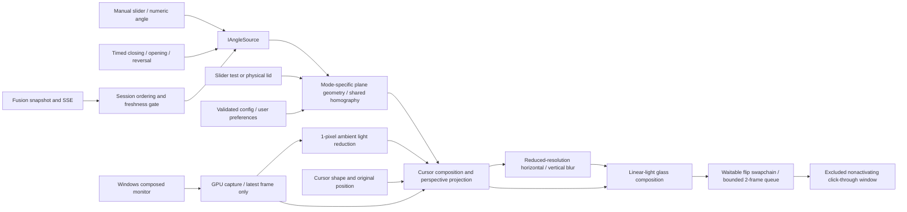
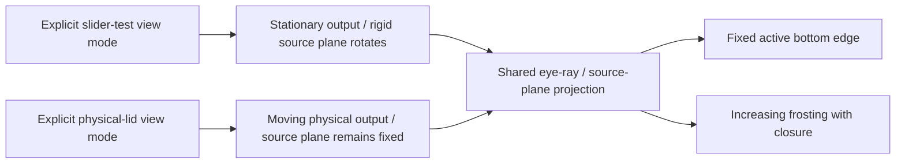
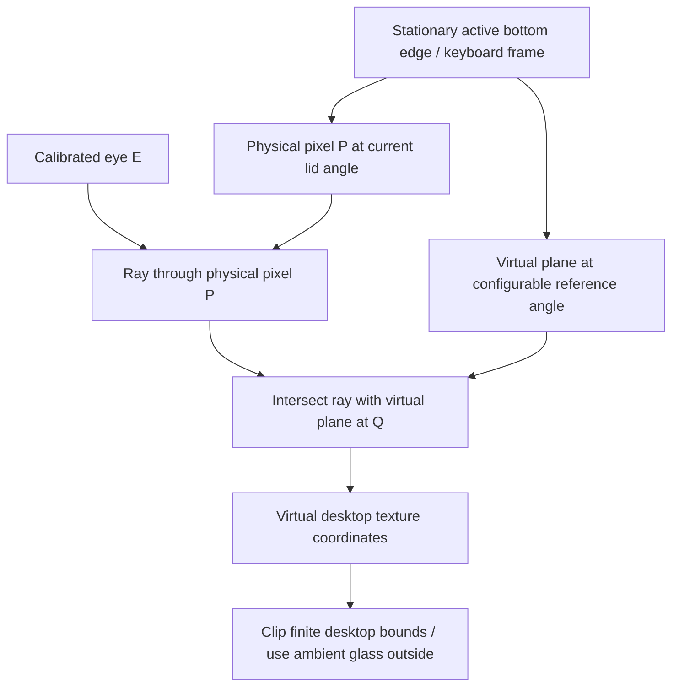
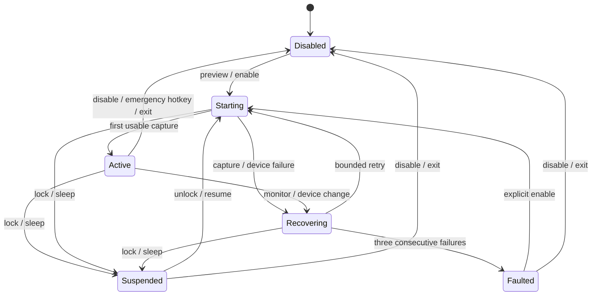

# Hinge Glass architecture

## Data flow



The UI thread owns Win32 controls, emergency hotkey and session/power notifications. A render thread owns the D3D immediate context and capture polling. Capture callbacks only signal an event; they never use the immediate context. A separate cancellable Fusion worker handles bounded loopback HTTP. Immutable angle-source ownership and settings snapshots cross the UI/render boundary under a mutex.

The GPU can differ from the display's adapter; Windows performs the capture/presentation transfer. Telemetry reports capture delivery latency separately from GPU shader duration. GPU query results are read asynchronously from a bounded query ring. Pixel readback exists only in explicit synthetic PNG diagnostics after measurement.

## Geometry



The two modes describe different physical arrangements. `rotation` is a stationary-screen inspection of relative plane rotation. It applies a true rotation to the source rectangle (width/height unchanged), with a centered pinhole camera `(0, screenHeight/2, -eyeY)` and fixed destination plane. The rotation is `referenceAngle − physicalAngle`. It culls the exact edge-on singularity and back faces. This avoids the magnified source strip produced when using physical compensation for a stationary-slider test.

`physical` is the actual product effect: the source plane and eye stay fixed in the keyboard frame and the destination plane follows the lid. Only the explicit **View mode** selector changes this choice. **Preview** and **Enable screen** select the output surface without changing projection. Synthetic and live sources use the same projection, cursor composition and frosting passes. The mode is independent of manual/Fusion angle selection. This prevents a successful grid test from using a different transformation than the live full-screen effect.



Coordinates are millimetres: x is right, y points forward across the keyboard, z points upward. A plane's upward direction is `(0, cos(angle), sin(angle))`. The **visual pivot is the complete active bottom edge**, fixed at `hingeOffset * referenceUp` in keyboard coordinates. Subtract that constant origin from the eye before forming the homography. Never rotate the hinge offset with the physical angle: doing so moved the bottom edge in 0.1.0. At angle 0 the visual panel lies over the keyboard. At the reference angle projection is identity; larger angles show the native desktop.

For eye E, physical pixel P, and virtual-plane normal n, the intersection is `Q = E - dot(n,E) / dot(n,P-E) * (P-E)`. Expanding this into a 3×3 homography avoids matrix inversions per pixel. Near-parallel or behind-eye rays produce ambient glass. The independent CPU test uses ray intersection directly rather than this expansion.

In stationary tests the same intersection helper uses a rotated source plane and fixed destination. Additional independent tests start with known source points, rigidly rotate them in 3D, project them forward, and check that inverse GPU sampling recovers the original texture coordinates. Physical-mode controls instead hold the world position of each image point constant while changing the destination angle. Neither path rescales a projected bounding box to fill the window. `fitPreview` uses one uniform scale for both window dimensions so non-16:10 monitors are not stretched.

Closure `c` is `smoothstep(0,1,clamp((reference-angle)/reference,0,1))`. Frost amount is `a = 1-(1-c)^frostResponse`, default response 3. Blur radius is `maxBlurPixels*a` (default maximum 64), and blurred-image weight is `1-(1-a)^2`. These curves increase monotonically, remain clear at reference and reach full frosting at closure. Rendering is a function of the current angle, so reopening retraces the geometry without a separate animation history. Frosting operates in physical-screen coordinates after projection. No black shutdown fade is used.

The separable Gaussian kernel samples consecutive texels at reduced resolution with sigma equal to one third of its radius. The radius expands with requested blur strength. This replaces sparse, widely spaced taps that produced duplicated-edge bands at the stronger setting. The bounded config (100-pixel maximum, reduced scale at most 0.5) bounds each pass to at most 101 taps, without full-resolution Gaussian passes.

## State and recovery



Angle freshness is separate: a stale source freezes the last rendered angle while capture continues. A static source image can legitimately keep the same capture timestamp. Resource failure hides the overlay and restores the cursor before retry. Recovery recreates device/capture/swapchain resources instead of reusing invalid surfaces.

## Cursor and input workflow

```mermaid
sequenceDiagram
  participant UI as Controls
  participant R as Renderer
  participant G as Cursor guardian
  participant OS as Windows / original application
  UI->>R: Enable below reference
  R->>G: Start process with parent handle
  G-->>R: Ready
  R->>OS: Hide duplicate system cursor
  OS-->>R: Cursor shape / original position
  R->>R: Composite cursor into virtual desktop
  OS->>OS: Deliver original mouse / keyboard input
  alt Normal disable or recovery
    R->>OS: Restore cursor; hide overlay
  else Renderer process exits or crashes
    G->>OS: Restore cursor visibility
    G->>G: Exit
  end
```

No pointer remapping, input injection, global input hooks, camera ownership, estimator modification or game process integration is used.
